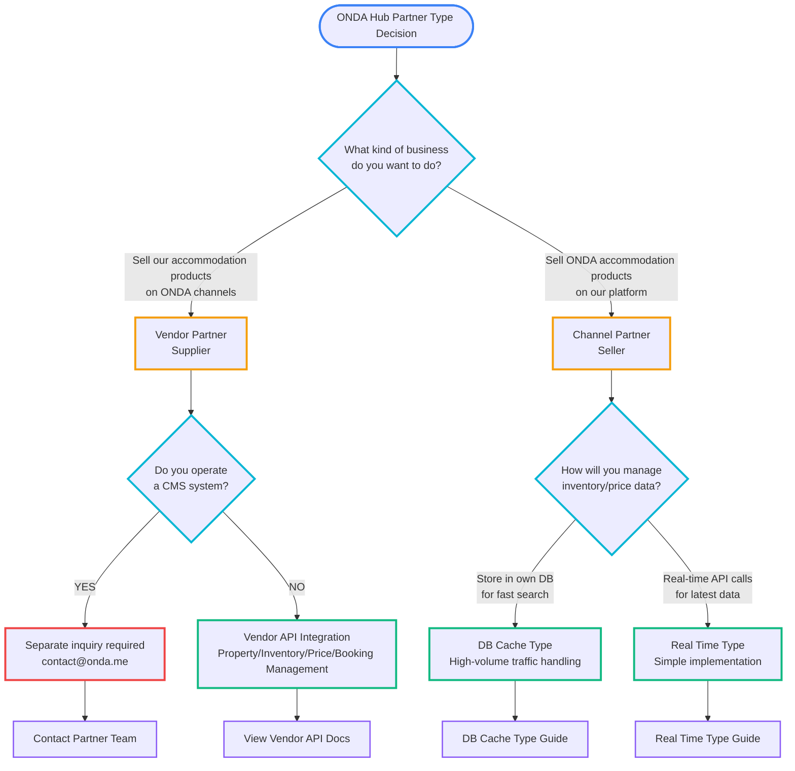
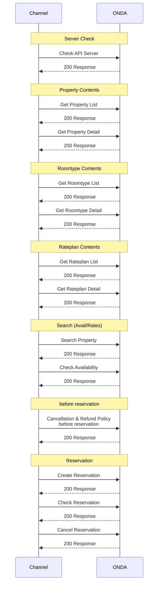
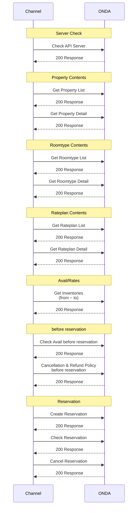

# CLAUDE.md — ONDA Channel Partner API
# Generated for Channel API integration. Place in your project root.

---


================================================================================
## Introduction
================================================================================

### ONDA Partner Developer Center

> Developer documentation for ONDA Hub API integration. Connect your accommodation platform quickly and easily! REST API guide for Vendor and Channel Partners, real-time integration with 25,000+ accommodation properties.

# ONDA Partner Developer Center

Welcome to the developer documentation for ONDA Hub API integration.

Expand your business with ONDA Hub's API, an integrated distribution platform connecting accommodation providers with sales channels.

## Before You Start

### What Type of Partner Are You?

ONDA Hub supports two types of partners:

#### Vendor Partner (Provider)
Do you want to supply accommodation properties to ONDA and sell through 70+ channels?
- Hotels, resorts, pensions, and other accommodation facilities
- PMS system providers
- Hotel chains and product suppliers

**→ [View Vendor API Documentation](/docs/api/vendor/vendor-api)**

#### Channel Partner (Seller)
Do you want to sell ONDA's 25,000+ accommodation properties?
- OTA (Online Travel Agency)
- Travel agencies and metasearch engines
- Accommodation booking platforms

**→ [View Channel API Documentation](/docs/api/channel/channel-api)**

## Quick Start Guide

ONDA Hub API integration follows 4 steps:

### 1. Identify Partner Type
Choose the API that fits your business model.

**→ [Partner Type Guide](/docs/getting-started)**

### 2. Contract and API Key Issuance
Receive your API key after signing a partnership agreement with ONDA.

**Contact:** contact@onda.me

### 3. API Integration Development
Average development time: **1 month (1 M/M)**

**Technical Support:** techsupport@onda.me

### 4. Testing and Launch
Launch your service after completing QA.

## Key Documentation

### Guides
- **[ONDA Hub Introduction](/docs/introduction)** - Detailed platform overview
- **[Getting Started](/docs/getting-started)** - Step-by-step integration guide
- **[Glossary](/docs/glossary)** - API terminology

### API Reference
- **[Vendor API](/docs/api/vendor/vendor-api)** - API for providers
- **[Channel API](/docs/api/channel/channel-api)** - API for sellers

### Resources
- **[Changelog](/changelog)** - API update news

## Technical Specifications

### API Endpoints
```
Production: https://gds.tport.io
Development: https://dapi.tport.dev
```

### Basic Information
- **Protocol:** HTTPS
- **Data Format:** JSON (UTF-8)
- **Authentication:** API Key / OAuth 2.0

## Technical Support

### Contact Channels
- **Technical Inquiries:** techsupport@onda.me
- **Partnership Applications:** contact@onda.me

### Support Hours
- Weekdays: 10:00 - 18:00 (KST)
- Emergency Support: 24/7

---

---

### ONDA Hub Introduction

> ONDA Hub is Korea

# ONDA Hub Introduction

ONDA Hub is **Korea's leading B2B accommodation API connectivity platform**, enabling **Vendor Partners** (hotels, PMS systems, property managers) and **Channel Partners** (OTAs, travel apps, booking platforms) to integrate with Korea's accommodation ecosystem through standardized REST APIs.

## What is ONDA Hub?

ONDA Hub is the core distribution infrastructure of the Korean accommodation industry — a central connectivity layer that links accommodation suppliers with sales channels across the full spectrum of Korean stays: hotels, resorts, pensions, motels, hanoks, pool villas, and more.

ONDA Hub provides the following core features:

- **Korean Accommodation Access**: 25,000+ properties across all Korean accommodation categories
- **Integrated Connectivity**: Connecting accommodation providers with 70+ OTAs and booking channels
- **Real-time Synchronization**: Real-time updates for content, inventory, pricing, and booking information
- **Standardized API**: Reduced complexity with consistent interfaces
- **Wide Product Categories**: Full range of Korean accommodation — from 5-star city hotels to unique stays like hanoks, pensions, and pool villas

## Partner Types

ONDA Hub partners are divided into two main categories:

### Vendor Partner (Provider)

Partners who supply accommodation products such as accommodation facilities, hotel chains, and PMS systems

**Key Features:**
- Product registration and management
- Real-time inventory/rate updates
- Booking reception and confirmation
- Settlement management

### Channel Partner (Seller)

Partners who sell accommodation products such as OTAs, travel agencies, and metasearch engines

**Key Features:**
- Sell up to 25,000+ accommodation properties
- Real-time inventory/price inquiry or updates
- Booking creation and management
- Integrated content management

## Development Timeline

Partners typically integrate ONDA Hub API in about one month of development.
(This refers to pure API integration development and may vary depending on the service the partner wants to implement.)
- **Vendor API**: Average 1 month (1 M/M)
- **Channel API**: Average 1 month (1 M/M)

## Technical Support

- **Documentation**: Detailed API documentation and guides
- **Technical Support**: Dedicated technical support team
- **Technical Inquiries**: techsupport@onda.me
- **Partnership Applications**: contact@onda.me

## Next Steps

- [Getting Started with ONDA Hub](/docs/getting-started)
- [Getting Started with Vendor API](/docs/api/vendor/vendor-api)
- [Getting Started with Channel API](/docs/api/channel/channel-api)
- [View Glossary](/docs/glossary)

---


================================================================================
## Getting Started
================================================================================

### Getting Started with ONDA Hub

> Step-by-step guide for ONDA Hub API integration. From identifying partner type to contracting, development, and launch - typically takes 1 month. Detailed instructions for Vendor API and Channel API integration.

# Getting Started with ONDA Hub

Step-by-step guide for integrating with ONDA Hub. Identify your partner type and choose the appropriate API to start your integration.

## Integration Timeline

<table style={{width: '100%'}}>
  <thead>
    <tr>
      <th style={{width: '20%'}}>Phase</th>
      <th style={{width: '20%'}}>Week 1</th>
      <th style={{width: '20%'}}>Week 2</th>
      <th style={{width: '20%'}}>Week 3</th>
      <th style={{width: '20%'}}>Week 4</th>
    </tr>
  </thead>
  <tbody>
    <tr>
      <td>1. Identify Partner Type</td>
      <td style={{textAlign: 'center', backgroundColor: '#3578e5', color: 'white'}}></td>
      <td style={{textAlign: 'center'}}></td>
      <td style={{textAlign: 'center'}}></td>
      <td style={{textAlign: 'center'}}></td>
    </tr>
    <tr>
      <td>2. ONDA hub Contract</td>
      <td style={{textAlign: 'center', backgroundColor: '#3578e5', color: 'white'}}></td>
      <td style={{textAlign: 'center', backgroundColor: '#3578e5', color: 'white'}}></td>
      <td style={{textAlign: 'center'}}></td>
      <td style={{textAlign: 'center'}}></td>
    </tr>
    <tr>
      <td>3. Integration Development</td>
      <td style={{textAlign: 'center'}}></td>
      <td style={{textAlign: 'center', backgroundColor: '#3578e5', color: 'white'}}></td>
      <td style={{textAlign: 'center', backgroundColor: '#3578e5', color: 'white'}}></td>
      <td style={{textAlign: 'center', backgroundColor: '#3578e5', color: 'white'}}></td>
    </tr>
    <tr>
      <td>4. Prepare for Official Launch</td>
      <td style={{textAlign: 'center'}}></td>
      <td style={{textAlign: 'center'}}></td>
      <td style={{textAlign: 'center'}}></td>
      <td style={{textAlign: 'center', backgroundColor: '#3578e5', color: 'white'}}></td>
    </tr>
  </tbody>
</table>

:::warning Note
The actual schedule may vary depending on your company's circumstances and requirements.
:::

## 1. Identify Partner Type

### Are You a Supplier or a Seller? Self-Assessment

Before integrating with ONDA hub, you must first clearly understand your company's business model.
If you need to discuss with ONDA for a stronger synergy with ONDA hub, please contact us through the following channels!

**Discuss with ONDA:**
- Website inquiry: https://www.onda.me/apply-form > Select inquiry type: Partnership, Marketing inquiry
- Email inquiry: contact@onda.me

### Questions to Help You Identify Your Partner Type

Use the following flowchart to determine the appropriate API type for your company.



---

## 2. ONDA hub Contract

Once you've determined your partner type, proceed with the official contract with ONDA hub.

**Contract Process:**
1. Complete partner application form
2. Submit business registration certificate and required documents
3. Negotiate contract terms
4. Sign contract
5. Receive API credentials

**Contact:**
- Email: contact@onda.me
- Confirm contract terms through consultation with our representative

---

## 3. Integration Development

Once the contract is completed, begin the actual API integration development.

### Review API Documentation
Carefully review the API documentation for the integration you want to implement.

- **Vendor Partner:** [Vendor API Documentation](/docs/api/vendor/vendor-api)
- **Channel Partner:** [Channel API Documentation](/docs/api/channel/channel-api)

### Create Development Requirements Checklist

Before integration development, you must create a development requirements checklist to define your integration concept, synchronize service flows, determine endpoints to use, and confirm policies. This checklist will be provided separately by the ONDA technical support team after contract negotiation.

### Development Kickoff Meeting

Conduct a kickoff meeting with the ONDA technical support team:
- Discuss integration schedule
- Identify technical issues
- Issue test accounts
- Set up development environment

### Integration Development Support

For issues that arise during development, contact the ONDA technical support team:
- **Technical inquiries**: techsupport@onda.me
- **Development guide**: Refer to each API documentation
- **Sample code**: Refer to examples in API documentation

### QA (Quality Assurance)

Once development is complete, conduct QA:
1. **Unit testing**: Test each API endpoint
2. **Integration testing**: Test complete workflow
3. **Performance testing**: Load testing and response time verification
4. **Security testing**: Authentication and data security verification

---

## 4. Prepare for Official Launch

Once QA is complete, proceed with final preparations for production operation.

### Operations Discussion
- Operating hours and incident response procedures
- Monitoring and alert configuration
- Data backup policy

### Settlement Discussion
- Commission policy confirmation
- Settlement cycle and method
- Tax invoice issuance process

### CS (Customer Support) Discussion
- Customer inquiry handling process
- Booking issue resolution procedures
- Emergency response plan

---

## Development Timeline Guide

Average development time for API integration:

- **Vendor API**: Average 1 month (1 M/M)
- **Channel API**: Average 1 month (1 M/M)

:::note Note
Actual development time may vary depending on your company's system environment and implementation scope.
:::

---

## Next Steps

Start your integration by referring to the documents below according to your partner type:

### Vendor Partner (Supplier)
- [Vendor API Documentation](/docs/api/vendor/vendor-api)

### Channel Partner (Seller)
- [Channel API Documentation](/docs/api/channel/channel-api)
- [DB Cache Type Implementation Guide](/docs/api/channel/db-cache-type)
- [Real Time Type Implementation Guide](/docs/api/channel/realtime-type)

### Additional Resources
- [Glossary](/docs/glossary)

---

**Contact Us:**
- Technical inquiries: techsupport@onda.me
- Partner application: contact@onda.me

:::tip Speed up integration with AI tools

If you use AI development tools like Claude Code, Cursor, or Windsurf,
download the ONDA API context files from the [AI Tools](/ai-tools) page.
Your AI assistant will understand the full API structure and suggest more accurate code.

:::

---


================================================================================
## FAQ
================================================================================

### Frequently Asked Questions (FAQ)

> Frequently asked questions about ONDA API integration. FAQ covering API key issuance, development timeline, authentication methods, Real Time Type vs DB Cache Type, Webhook, test environment, and more

# Frequently Asked Questions (FAQ)

Here are frequently asked questions about ONDA API integration.

---

## Basic Information

<details open>
<summary><strong>Q. What is ONDA Hub?</strong></summary>

ONDA Hub is an integrated distribution platform that connects accommodation product suppliers with sales channels.

- **Vendor (Supplier)**: Supply accommodation products to ONDA and sell on 70+ channels
- **Channel (Seller)**: Sell ONDA's 25,000+ accommodation products

Through RESTful-based APIs, you can perform real-time inventory/price inquiries, booking processing, and more.

</details>

<details>
<summary><strong>Q. What is the difference between Vendor and Channel partners?</strong></summary>

**Vendor Partner (Supplier)**
- Hotels, resorts, pensions, and other accommodation facilities
- PMS system providers
- Hotel chains and product suppliers
- **Purpose**: Supply accommodation products to ONDA and sell through multiple channels

**Channel Partner (Seller)**
- OTA (Online Travel Agency)
- Travel agencies and metasearch engines
- Accommodation booking platforms
- **Purpose**: Sell ONDA's accommodation products on their own platform

</details>

<details>
<summary><strong>Q. Which partner type should I choose?</strong></summary>

Choose according to your company's business model:

- Do you **supply accommodation products**? → Use **Vendor API**
- Do you **sell accommodation products**? → Use **Channel API**

For more details, please refer to the [Getting Started](/docs/getting-started) page.

</details>

---

## Getting Started

<details>
<summary><strong>Q. How long does API integration development take?</strong></summary>

**Average Development Timeline**
- **Channel API**: Approximately 2 weeks (average)
- **Vendor API**: Approximately 1 month (1 M/M)

Actual development time may vary depending on implementation scope and development resources.

</details>

<details>
<summary><strong>Q. How do I get an API key?</strong></summary>

**Issuance Process**
1. Sign partnership contract with ONDA
2. Receive API key for development environment
3. Conduct development and testing
4. Receive API key for production environment
5. Start official service

**Contact**
- Partner application: contact@onda.me
- Technical inquiries: techsupport@onda.me

</details>

<details>
<summary><strong>Q. How do I set up the test environment?</strong></summary>

ONDA provides separate development and production environments:

**Development Environment**
- URL: `https://dapi.tport.dev`
- Purpose: API integration development and testing

**Production Environment**
- URL: `https://gds.tport.io`
- Purpose: Actual service operation

A separate API key is issued for each environment.

</details>

---

## Technical Specifications

<details>
<summary><strong>Q. What are the API endpoints?</strong></summary>

**Development Environment**
```
https://dapi.tport.dev
```

**Production Environment**
```
https://gds.tport.io
```

All APIs use the HTTPS protocol.

</details>

<details>
<summary><strong>Q. What data format is used?</strong></summary>

**Basic Information**
- **Protocol**: HTTPS
- **Data format**: JSON (UTF-8 encoding)
- **HTTP methods**: GET, POST, PUT, PATCH, DELETE
- **Content-Type**: `application/json`

All requests and responses are processed in JSON format.

</details>

<details>
<summary><strong>Q. How do I authenticate with the API?</strong></summary>

**Channel API Authentication**

You must include the following two keys in the HTTP header:

1. **Authorization Key**
   - Header: `x-api-key`
   - API authentication key issued by ONDA

2. **Channel Key**
   - Header: `x-channel-key`
   - Unique key to identify the channel

**Vendor API Authentication**

This follows the authentication method provided by ONDA, which will be explained in detail upon contract signing.

</details>

---

## Integration Methods

<details>
<summary><strong>Q. What is the difference between Real Time Type and DB Cache Type?</strong></summary>

**Real Time Type**
- Calls ONDA API in real-time whenever a customer searches
- No need to store inventory/rates in DB
- No Webhook development required
- Relatively simple implementation

**DB Cache Type**
- Stores all product inventory/rates in channel DB
- Queries own DB when customers search (fast response)
- Webhook development required (real-time updates)
- Advantageous for high-volume traffic handling

For more details, refer to:
- [Real Time Type](/docs/api/channel/realtime-type)
- [DB Cache Type](/docs/api/channel/db-cache-type)

</details>

<details>
<summary><strong>Q. What is Webhook and when is it needed?</strong></summary>

**What is Webhook?**

A push-based API that notifies channels in real-time when information changes in ONDA.

**Webhook Types**
- `contents_updated`: Property/room/package content change notification
- `status_updated`: Product addition or sales status change notification
- `inventory_updated`: Rate/inventory change notification

**When Needed**
- **Required for DB Cache Type integration**
- Optional for Real Time Type

For more details, refer to [Webhook Overview](/docs/api/channel/webhook-overview).

</details>

<details>
<summary><strong>Q. What is the difference between ONDA → Vendor and Vendor → ONDA methods?</strong></summary>

Vendor API provides two integration methods:

**ONDA → Vendor (Pull method)**
- ONDA calls the Vendor system's API
- Real-time data synchronization
- Vendor provides API and responds

**Vendor → ONDA (Push method)**
- Vendor calls ONDA API to update information
- Sends immediately when changes occur
- ONDA receives and stores data

In most cases, both methods are used together.

</details>

---

## Booking and Testing

<details>
<summary><strong>Q. How do I use test properties?</strong></summary>

**Test Property IDs**

| Property ID | Type | Includes Rateplan |
|------------|------|------------------|
| 117417 | Hotel | Included |
| 120135 | Hotel | Included |

**Important Notes**
- You cannot test with actual properties
- Booking tests must be conducted only with the above test properties
- You must complete cancellation processing after booking tests

For more details, refer to [Test Properties for Booking](/docs/api/channel/test-property).

</details>

<details>
<summary><strong>Q. Can I query actual property content?</strong></summary>

**Yes** (with conditions)

- Prior consultation with your account manager required
- You can query up to **content information** of actual properties
- However, **booking tests are strictly prohibited** (use test properties only)

Please note that creating a booking with an actual property will result in a real booking.

</details>

---

## Technical Support

<details>
<summary><strong>Q. Where should I send technical inquiries?</strong></summary>

**Contact Channels**

- **Technical inquiries**: techsupport@onda.me
- **Partner application**: contact@onda.me

**Support Hours**
- Weekdays 10:00 - 18:00 (KST)
- Emergency incidents: 24/7 response

When inquiring via email, please include the following information:
- Partner company name
- API type (Vendor/Channel)
- Environment (Development/Production)
- Specific inquiry details

</details>

<details>
<summary><strong>Q. How should I respond to API outages?</strong></summary>

**Emergency Incident Response**
- 24/7 emergency response system in operation
- Contact techsupport@onda.me immediately

**Information to Include When Reporting Incidents**
- Time of occurrence
- Error message or response code
- Request parameters (excluding sensitive information)
- Whether reproducible

Please provide specific information for faster resolution.

</details>

---

## Additional Documentation

For more detailed information, please refer to the following documents:

- [ONDA Hub Introduction](/docs/introduction)
- [Getting Started Guide](/docs/getting-started)
- [Vendor API Documentation](/docs/api/vendor/vendor-api)
- [Channel API Documentation](/docs/api/channel/channel-api)
- [API Changelog](/changelog)

---


================================================================================
## Channel API
================================================================================

### ONDA Channel API

## 1. Introduction

This API documentation is provided for distributors to integrate and sell ONDA's general accommodation and package products.

The Channel Affiliate API provided by ONDA is a **RESTful-based API** that enables integration and sales of over 50,000 properties in the ONDA GDS.

On average, affiliate partners (hereinafter referred to as Channels) **complete the integration with ONDA with an average investment of 2 weeks of development time**.

## 2. Features

### **Content Provision**

- Property content
- Room content
- Package content

### **Real-time Inventory/Price Search**

- Real-time availability search
- Real-time inventory/price verification

### **Inventory/Price Cache**

- Daily inventory/price storage
- Daily lowest price storage

### **Reservations**

- Real-time cancellation and refund policy verification
- Reservation creation
- Reservation inquiry
- Reservation cancellation

## 3. API List

| API Name | Method | Endpoint | Description |
|----------|---------|----------|-------------|
| Get Property List | `GET` | [Get Property List](get-property-list) | Returns a list of all properties. |
| Get Property Detail | `GET` | [Get Property Detail](get-property-detail) | Returns detailed information for a specific property. |
| Get Roomtype List | `GET` | [Get Roomtype List](get-roomtype-list) | Returns a list of all room types for a specific property. |
| Get Roomtype Detail | `GET` | [Get Roomtype Detail](get-roomtype-detail) | Returns detailed information for a specific room. |
| Get Rateplan List | `GET` | [Get Rateplan List](get-rateplan-list) | Returns a list of all packages for a specific room. |
| Get Rateplan Detail | `GET` | [Get Rateplan Detail](get-rateplan-detail) | Returns detailed information for a specific package. |
| Search Property | `GET` | [Search Property](search-property) | Returns available properties that meet the specified criteria. |
| Search Property Detail | `GET` | [Search Property Detail](check-availabilities-rates) | Returns the actual available inventory and rates for a specific property.<br/>You can also search for package products. |
| Get Inventories | `GET` | [Get Inventories](get-inventories) | Returns all inventory and rates within a period for a specific property. |
| Get Lowest Price | `GET` | [Get Lowest Price](check-lowest-price) | Returns the lowest daily rates for a specific property. |
| Cancellation & Refund Policy before reservation | `GET` | [Cancellation & Refund Policy before reservation](cancellation-refund-policy-before-reservation) | Returns the cancellation and refund policy immediately before reservation. |
| Create Reservation | `POST` | [Create Reservation](create-reservation) | Creates a reservation. |
| Check Reservation | `GET` | [Check Reservation](check-reservation) | Retrieves reservation information. |
| Cancel Reservation | `PUT` | [Cancel Reservation](cancel-reservation) | Cancels a reservation. |

---

### API Integration Process

> Step-by-step ONDA API integration process guide

# API Integration Process

## 1. Check Integration Method

To obtain preliminary information about the integration method according to the channel's service, check the following:

- Do they store and service rates and inventory? Or do they call from the client each time for service?
- Is the channel's service type a metasearch platform? Or an OTA vertical service?

## 2. Review API Documentation

After completing the NDA, deliver the API documentation to the channel for review.

## 3. Pre-development Meeting

Once API documentation review is complete, hold a general integration guide meeting. Through this meeting, synchronize on the following:

- [Channel > ONDA] Review the channel's service they want to integrate.
- [ONDA > Channel] Guide through the overall integration process.
- [ONDA > Channel] Estimate and synchronize approximate development schedule.

## 4. Integration Development

Integration development direction is determined by two service types. This is guided through information obtained in '1. Check Integration Method'.
The biggest difference between types is the processing method for 'inventory and rates'.

You can check the Sequence Diagrams for the two service types below.

- [DB Cache Type](ref:db-cache-type)
- [Real Time Type](ref:real-time-type)

## 5. Testing

Conduct API testing in both ONDA and the sales channel's development environments.

- Product registration
- Rate and inventory synchronization
- Reservation testing
- Webhook testing

## 6. Live Deployment

After testing in the development environment is complete, deploy to both parties' production environments, register actual products, and start sales.

---

### Authorization

> ONDA API authorization key guide

# Authorization

## Authorization Key?

An authorization key is required to call ONDA's API.
Authorization keys are divided into development environment keys and production environment keys, and are issued in stages and shared separately by your account manager.

## Development (Dev) Authorization Key

The development environment authorization key is provided after signing an NDA with ONDA or completing the initial contract.

## Production (Live) Authorization Key

The production environment authorization key is provided along with the production environment host domain once development and testing in the development environment are completed.
It is never provided before testing in the development environment is completed.

---

### Real Time Type

> Integration type with real-time API calls

# Real Time Type

Real Time Type checks inventory and rate information in real-time by calling the ONDA API whenever an event occurs in the service client. Channels can provide service without needing to store inventory and rates in their database.

## Real Time Type Basic Sequence



## Content Synchronization

Channel DB Cache is the initial synchronization step where you retrieve and store Property, Roomtype, and Rateplan information. Subsequently, content updated in ONDA can be received through Webhooks.

## Inventory Updates

You can receive inventory updates in real-time using Search Property. At this time, properties (Property ID) are limited to a maximum of 200, with 50 commonly recommended. Develop considering your channel's response speed.

---

### DB Cache Type

> Integration type that stores inventory/rates in database

# DB Cache Type

DB Cache Type refers to a format that stores rates and inventory for all sales products in the channel's database before providing service.
In this case, **Webhook development is required** to update rates and inventory in real-time.

## DB Cache Type Basic Sequence



---

### Test Property

> Test property information and usage guide

# Test Property

## Basic

- **Testing with actual properties is not allowed.**
- According to prior agreement with the account manager, you may call **up to content information** of actual properties.
- Basically, you **must never proceed with reservation testing** with property_ids other than those listed below.
- After making a reservation using test property products, you must proceed with cancellation.

## Test Property Account

| property_id | classifications | Includes rateplan |
| :---------- | :-------------- | :------------ |
| 117417      | Hotel HOTEL        | Included            |
| 120135      | Hotel HOTEL        | Included            |

---


================================================================================
## Channel API - Property
================================================================================

### Property Tags

> Property-related tag information

# Property Tags

Complete list of property-related tags provided by ONDA.

## 📌 Property Characteristic Tags (property_tags)

Tags representing property concept, characteristics, and grade.

- Family
- Luxury/Premium
- Group/MT/Workshop
- Couple
- Pool Villa
- Traditional House
- Pet-friendly Pension
- Kids Pension
- 5-Star
- 4-Star
- 3-Star
- 2-Star
- 1-Star
- Deluxe 1st Grade
- Deluxe
- 1st Grade
- Tourist
- Business
- Residence
- Boutique

## 🏢 Property Classification (classifications)

Tags that categorize the basic type of property.

- Hotel
- Pension
- Guesthouse
- Motel
- Caravan
- Glamping
- Camping
- Resort
- Traditional House (Hanok)
- Pool Villa
- Residence

## 🏊 Facility Tags (facility_tags)

Tags representing facilities available at the property.

- Spa/Whirlpool
- Karaoke
- Basketball Court
- Convenience Store
- BBQ Area
- Seminar Room
- Swimming Pool
- Water Slide
- Foot Volleyball Court
- Sauna Room
- Soccer Field/Futsal Court
- Cafe
- Table Tennis
- Fitness
- Public Spa
- Golf Course
- Restaurant
- Kids Playroom
- Public Shower
- Public Restroom
- Shared Kitchen
- Water Park
- Hot Spring
- Sauna
- Banquet Hall
- Business Center
- Rooftop
- Baby Facilities

## 🌊 Attraction Tags (attraction_tags)

Tags representing nearby tourist attractions and activities.

- Near Valley
- Near Golf Course
- Near Fishing Area
- Near Arboretum/Recreation Forest
- Water Sports
- Near Ski Resort
- Near Beach
- Near River/Lake

## 🛎️ Service Tags (service_tags)

Tags representing services provided by the property.

- WIFI
- Pet Friendly
- Valet Parking
- Board Games
- Shuttle Bus
- Movie Screening
- Bicycle Rental
- Breakfast Service
- Luggage Storage
- Cooking Facilities
- Campfire
- Proposal/Party/Event
- Printer Access
- Pick-up
- First Aid Kit
- Non-smoking
- In-room Smoking
- Personal Locker
- Free Parking
- Accessible Facilities
- Airport Shuttle
- Bar/Lounge
- Massage
- Parking Available
- Basic Seasonings

## 🛏️ Amenity Tags (amenity_tags)

Tags representing in-room amenities.

- Gas Range/Induction
- Private/Terrace BBQ
- Basic Seasonings
- Refrigerator
- Iron
- Hair Dryer
- Mini Bar
- Fireplace
- Sofa
- Spa/Whirlpool
- Dining Table
- Air Conditioning
- Toiletries
- Bathtub
- Rice Cooker
- Microwave
- Cooking Utensils
- Coffee Pot
- Towels
- TV
- Private Pool
- Bidet
- Smoking Allowed
- Party Room
- Toilet
- VOD

---

### Roomtype Tags

> Room-related tag information

# Roomtype Tags

Complete list of room-related tags provided by ONDA.

## 🏠 Room Type Tags (roomtype_tags)

Tags representing room structure and layout.

- Dormitory Style
- Standalone House
- Duplex Style
- Studio Style
- Separate Style
- Single Room
- Double Room
- Twin Room
- Ondol Room
- Triple Room
- Family Room
- Suite Room
- Penthouse
- Women Only
- Men Only
- Mixed Gender

## 🌅 View Tags (view_tags)

Tags representing the view from the room.

- Ocean View
- Mountain View
- City View
- Garden View
- Pool View
- River View
- Harbor View

---

### Image Contents

> Image content storage and resize guide

# Image Contents

## Image Content Storage

- Images provided by ONDA must be separately stored and used by the channel itself. (e.g., S3)
- This API basically stores property information, room information, rates/inventory, images, etc. in the channel's own database.

## Image Resize

- The images provided by default are original files.
- If the image size is too large and burdensome, process in the following order.
- You can successfully call by changing the `-original` part at the end of the image URL to the appropriate size below.
- Available sizes are 1000, 500, 150, original. `*1000 size is recommended.`

## Image Samples

**original size** (default)

- https://image.tport.io/extranet/properties/117417/2869cc0d-c7ec-f2af-bb72-8715b2e5acca-original.jpg

**1000 size**

- https://image.tport.io/extranet/properties/117417/2869cc0d-c7ec-f2af-bb72-8715b2e5acca-1000.jpg

**500 size**

- https://image.tport.io/extranet/properties/117417/2869cc0d-c7ec-f2af-bb72-8715b2e5acca-500.jpg

**250 size**

- https://image.tport.io/extranet/properties/117417/2869cc0d-c7ec-f2af-bb72-8715b2e5acca-250.jpg

---


================================================================================
## Channel API - Reservation
================================================================================

### Cancellation Policy

> Cancellation and refund policy guide

# Cancellation Policy

> ❗️
>
> The cancellation policy at search time and **the actual cancellation policy for bookings may differ**.
> Please follow this guide to prevent any claims.

## Key Summary

- **Two policies exist**: Static Policy (for search) and Dynamic Policy (actually applied)
- **Cancellations use Dynamic Policy**: Dynamic Policy is applied when canceling a reservation
- **Check before booking**: Always query Dynamic Policy before payment and inform the customer

## Two Cancellation Policies

ONDA's cancellation policy is divided into **Static Policy** and **Dynamic Policy**.

| Category | Static Policy | Dynamic Policy |
|----------|---------------|----------------|
| **Purpose** | Display in search results | Applied at actual cancellation |
| **Characteristics** | Property-level default (conservative) | Actual policy by room/time |
| **API** | [Search Property Detail](check-availabilities-rates) | [Cancellation & Refund Policy before reservation](cancellation-refund-policy-before-reservation) |
| **Field** | `refund_policy` object | `refund_policy` object |

## Static Policy

A **default policy** set at the property level, displaying the most conservative cancellation policy.

- **API**:
  - `refund_policy` object in [Search Property Detail](check-availabilities-rates)
  - `property_refunds` object in [Get Property Detail](get-property-detail) (same value)
- **Purpose**: Provide approximate cancellation policy in search results
- **Note**: May differ from the policy applied at actual cancellation

> ⚠️ **Caution**
>
> Do not provide customers with a confirmed cancellation policy based on Static Policy alone.
> Cancellation fees and refund amounts may differ at actual cancellation.

## Dynamic Policy

The **actual cancellation policy** for the room the customer wants to book. It may vary by room, date, and time.

- **API**: `refund_policy` object in [Cancellation & Refund Policy before reservation](cancellation-refund-policy-before-reservation)
- **Purpose**: Check the actual policy to be applied just before booking
- **Application**: This policy is applied when the customer cancels

> 💡 **Key Point**
>
> **Dynamic Policy is always applied** when canceling a reservation.

## Implementation Guide

Partners should handle cancellation policies with the following flow:

### Step 1: Display Search Results
```
API: Search Property Detail
Display: Static Policy (for reference)
```
- Provide approximate cancellation policy in search results
- Recommended text: "Cancellation policy may change at time of booking"

### Step 2: Check Before Booking
```
API: Cancellation & Refund Policy before reservation
Display: Dynamic Policy (actually applied)
```
- Must be called before payment to check the actual cancellation policy
- Clearly inform the customer of this policy

### Step 3: Process Cancellation
```
Applied: Dynamic Policy
```
- Cancellation fees/refunds are processed according to Dynamic Policy

---


================================================================================
## Channel API - Webhook
================================================================================

### Webhook Overview

> ONDA Webhook API overview and setup guide

# Webhook Overview

## Webhook?

This is an API used to enable real-time updates of content, rates, and inventory information for properties, room types, and packages changed in ONDA GDS to channels.

The default Method for Webhook API sent from ONDA is `PUT`.

## Webhook Types

| Webhook             | Description                                                 |
| :------------------ | :---------------------------------------------------------- |
| `contents_updated`  | Webhook that notifies **that content information** of properties, room types, and package plans has changed.          |
| `status_updated`   | Webhook that notifies **information about newly added** properties, room types, and package plans or **changed sales status information**. |
| `inventory_updated` | Webhook that **notifies rate and inventory information** for a specific date of a specific package plan.                 |

## Webhook Setup Process

1. The channel selects which type of Webhook API spec to develop.
2. The channel develops based on the Webhook API spec provided by ONDA.
3. Share Webhook API environment information such as API domain and Auth Key with ONDA.
4. ONDA sets the shared environment information and deploys it.
5. Execute updated items for each item and test mutually.

---

### Webhook Specifications

> Detailed webhook API specifications and samples

# Webhook Specifications

## Object

### event_type

Declares the event for each webhook.
The Body values called vary depending on each event.

#### Example:

```json
"event_type": "contents_updated"
```

#### Available `event_type` values:

- `contents_updated`
- `status_updated`
- `inventory_updated`

### event_detail

Contains detailed content about `event_type`. Attributes included may vary depending on `event_type` and `event_detail`. Please refer to the Sample for each `event_type / event_detail` below.

For inventory_updated, it responds as `event_details` plural Array.

## Sample

### contents_updated

If `contents_update` is confirmed in `event_type`, it means the content of the specified `target` has been updated. Please call each content API to update content using the id of each target.

If there are no property, roomtype, or rateplan to update, please add them as new.

`UPSERT`

#### target = property Sample

```json
{
    "event_type": "contents_updated",
    "event_detail": {
        "target": "property",
        "property_id": 32124
    },
    "timestamp": "2021-01-27T10:39:12+09:00"
}
```

#### target = roomtype Sample

```json
{
    "event_type": "contents_updated",
    "event_detail": {
        "target": "roomtype",
        "property_id": 32124,
        "roomtype_id": 111111
    },
    "timestamp": "2021-01-27T10:39:12+09:00"
}
```

#### target = rateplan Sample

```json
{
    "event_type": "contents_updated",
    "event_detail": {
        "target": "rateplan",
        "property_id": 32124,
        "roomtype_id": 111111,
        "rateplan_id": 1234567
    },
    "timestamp": "2021-01-27T10:39:12+09:00"
}
```

### status_updated

If `status_update` is confirmed in `event_type`, it means the status of the specified `target` has changed. Please process the status update for the id of each target.

#### Supported statuses:

| status | description |
|--------|-------------|
| enabled | Means the sales status has been changed to active.<br/>Please update to active status. |
| disabled | Means the sales status has been changed to inactive.<br/>Please update to inactive status. |
| deleted | Means permanently deleted so it can no longer be sold.<br/>Please update to deleted status or inactive status. |

#### target = property Sample / disabled case

```json
{
    "event_type": "status_updated",
    "event_detail": {
        "target": "property",
        "property_id": 32124,
        "status": "disabled"
    },
    "timestamp": "2021-01-27T10:39:12+09:00"
}
```

#### target = roomtype Sample / enabled case

```json
{
    "event_type": "status_updated",
    "event_detail": {
        "target": "roomtype",
        "property_id": 32124,
        "roomtype_id": 111111,
        "status": "enabled"
    },
    "timestamp": "2021-01-27T10:39:12+09:00"
}
```

#### target = rateplan Sample / deleted case

```json
{
    "event_type": "status_updated",
    "event_detail": {
        "target": "rateplan",
        "property_id": 32124,
        "roomtype_id": 111111,
        "rateplan_id": 1234567,
        "status": "deleted"
    },
    "timestamp": "2021-01-27T10:39:12+09:00"
}
```

### inventory_updated

Includes newly added or changed rate and inventory information. Please add or update the rate and inventory information of `rateplan_id` as is. `UPSERT`

If updates are for multiple dates, `event_detail` responds as an Array in one webhook.

#### Supported Information Fields

| Field | Description |
|-------|-------------|
| `date` | Check-in date to which rate/inventory applies. |
| `basic_price` | Basic rate. |
| `sale_price` | Actual sale price. sale_price cannot be greater than basic_price.<br/>The discount rate can be calculated through the difference with basic_price. |
| `extra_adult` | Additional adult cost. |
| `extra_child` | Additional child cost. |
| `extra_infant` | Additional infant cost. |
| `promotion_type` | Returns if there is a specified promotion applied to basic_price. Returns Null if none. |
| `vacancy` | Number of available inventory.<br/>If 0, reservation is not possible due to no inventory. |

#### available case / vacancy >= 1

```json
{
    "event_type": "inventory_updated",
    "event_details": [
      {
        "property_id": 32124,
        "roomtype_id": 111111,
        "rateplan_id": 1234567,
        "date": "2022-10-10",
        "basic_price": 100000,
        "sale_price": 80000,
        "extra_adult": 10000,
        "extra_child": 0,
        "extra_infant": 0,
        "promotion_type": null,
        "vacancy": 1
      }
  ],
    "timestamp": "2021-01-27T10:39:12+09:00"
}
```

#### unavailable case / vacancy = 0

```json
{
    "event_type": "inventory_updated",
    "event_details": [
      {
        "property_id": 32124,
        "roomtype_id": 111111,
        "rateplan_id": 1234567,
        "date": "2022-10-10",
        "basic_price": 100000,
        "sale_price": 80000,
        "extra_adult": 10000,
        "extra_child": 0,
        "extra_infant": 0,
        "promotion_type": null,
        "vacancy": 0
      }
  ],
    "timestamp": "2021-01-27T10:39:12+09:00"
}
```

#### update array case

```json
{
    "event_type": "inventory_updated",
    "event_details": [
      {
        "property_id": 32124,
        "roomtype_id": 111111,
        "rateplan_id": 1234567,
        "date": "2022-10-10",
        "basic_price": 100000,
        "sale_price": 80000,
        "extra_adult": 10000,
        "extra_child": 0,
        "extra_infant": 0,
        "promotion_type": null,
        "vacancy": 1
      },
      {
        "property_id": 32124,
        "roomtype_id": 111111,
        "rateplan_id": 1234567,
        "date": "2022-10-11",
        "basic_price": 100000,
        "sale_price": 80000,
        "extra_adult": 10000,
        "extra_child": 0,
        "extra_infant": 0,
        "promotion_type": null,
        "vacancy": 1
      },
      {
        "property_id": 32124,
        "roomtype_id": 111111,
        "rateplan_id": 1234567,
        "date": "2022-10-12",
        "basic_price": 100000,
        "sale_price": 70000,
        "extra_adult": 10000,
        "extra_child": 0,
        "extra_infant": 0,
        "promotion_type": null,
        "vacancy": 0
      },
      {
        "property_id": 32124,
        "roomtype_id": 337222,
        "rateplan_id": 7654321,
        "date": "2022-10-10",
        "basic_price": 100000,
        "sale_price": 80000,
        "extra_adult": 10000,
        "extra_child": 0,
        "extra_infant": 0,
        "promotion_type": null,
        "vacancy": 0
      }
  ],
    "timestamp": "2021-01-27T10:39:12+09:00"
}
```

---


================================================================================
## Channel API — Endpoint Reference
================================================================================

### PUT /properties/{property_id}/bookings/{booking_number}/cancel — Cancel Reservation

**Parameters:**

| Name | In | Type | Required | Description |
|------|----|------|----------|-------------|
| `property_id` | path | string | ✓ |  |
| `booking_number` | path | string | ✓ |  |

**Request Body** (`application/json`):

| Field | Type | Required | Description |
|-------|------|----------|-------------|
| `canceled_by` | string |  | `user` or `system`. Enum: `user`, `system` |
| `reason` | string |  |  |
| `currency` | string |  | 요금제 기준 통화 \| ISO4217 |
| `total_amount` | integer (int32) |  | 총 결제 금액 |
| `refund_amount` | integer (int32) |  | 환불 금액 |

**Responses:**

**200**:

| Field | Type | Description |
|-------|------|-------------|
| `booking_number` | string | 온다 예약번호 |
| `channel_booking_number` | string | 판매사 예약 번호 |
| `currency` | string | 요금제 기준 통화 \| ISO4217 |
| `total_amount` | integer | 예약 된 총 요금 |
| `refund_amount` | integer | 고객 환불 요금 |

```json
{
    "booking_number": "TPORT-REC3R6T5H",
    "channel_booking_number": "DDDDAAAAA20220701",
    "currency": "KRW",
    "total_amount": 104250,
    "refund_amount": 52125
}
```

**400**:

---

### GET /properties/{property_id}/roomtypes/{roomtype_id}/rateplans/{rateplan_id}/refund_policy — Cancellation & Refund Policy before reservation

**Parameters:**

| Name | In | Type | Required | Description |
|------|----|------|----------|-------------|
| `property_id` | path | string | ✓ |  |
| `roomtype_id` | path | string | ✓ |  |
| `rateplan_id` | path | string | ✓ |  |
| `checkin` | query | string |  |  |
| `checkout` | query | string |  |  |

**Responses:**

**200**:

| Field | Type | Description |
|-------|------|-------------|
| `checkin` | string | 체크인 시각 \| yyyy-mm-dd hh:mm:ss |
| `checkout` | string | 체크아웃 시각 \| yyyy-mm-dd hh:mm:ss |
| `refund_type` | string | 취환불 적용 타입
\- nights: (연박 예약 시) 전체 예약 요금에 대해 체크인 날짜를 기준으로 취소환불정책을 일괄 적용
\- 향후에 다양한 정책을 적용할 예정입니다. 현재는 'nights'만 제공. Enum: `nights` |
| `refund_policy` | array | 실제 확정 취환불정책
\- 참고: Contents API의 취환불 정책은 숙박시설의 대표 취환불 정책이고, 실제 객실타입과 요금제에 따라 취환불 정책이 상이할 수 있음. |
| `refund_policy[].until` | string | ISO8601 형식 |
| `refund_policy[].percent` | integer | 고객이 환불 받을 수 있는 비율 |
| `refund_policy[].refund_amount` | integer | 고객이 환불 받을 수 있는 요금 |
| `refund_policy[].charge_amount` | integer | 고객이 환불 받지 못하는 취소 수수료 요금 |

```json
{
    "checkin": "2022-04-19 22:00",
    "checkout": "2022-04-20 13:00",
		"type": "nights",
    "refund_policy": [
        {          
            "until": "2022-04-13T23:59:59+09:00",
            "percent": 100,
            "refund_amount": 161000,
            "charge_amount": 0
        },
        {
            "type": "refund",
            "until": "2022-04-14T23:59:59+09:00",
            "percent": 90,
            "refund_amount": 161000,
            "charge_amount": 161000
        },
        {
            "type": "refund",
            "until": "2022-04-15T23:59:59+09:00",
            "percent": 80,
            "refund_amount": 161000,
            "charge_amount": 161000
        },
        {
            "type": "refund",
            "until": "2022-04-16T23:59:59+09:00",
            "percent": 70,
            "refund_amount": 161000,
            "charge_amount": 161000
        },
        {
            "type": "refund",
            "until": "2022-04-17T23:59:59+09:00",
            "percent": 50,
            "refund_amount": 161000,
            "charge_amount": 161000
        },
        {
            "type": "refund",
            "until": "2022-04-19T23:59:59+09:00",
            "percent": 0,
            "refund_amount": 0,
            "charge_amount": 161000
        }
    ]
}
```

**400**:

---

### GET / — Check API Server

**Responses:**

**200**:

| Field | Type | Description |
|-------|------|-------------|
| `message` | string | 연결 상태 |
| `domain` | string | 판매사의 도메인 |
| `alias` | string | 판매사명 |

```json
{
  "message": "OK",
  "domain": "tport.io",
  "alias": "GDS (Test Channel)"
}
```

**400**:

---

### GET /search/properties/{property_id} — Search Property Detail

Returns all available room types and rate plans for a property matching the specified criteria in **real-time**.

**Parameters:**

| Name | In | Type | Required | Description |
|------|----|------|----------|-------------|
| `property_id` | path | string | ✓ |  |
| `checkin` | query | string | ✓ |  |
| `checkout` | query | string | ✓ |  |
| `adult` | query | integer | ✓ |  |
| `child_age` | query | array |  |  |
| `locale` | header | string (ko-KR|en-US|zh-CN|ja-JP|vn-VN|th-TH|zh-TW) |  | `locale` ko-KR, en-US, zh-CN, ja-JP, vn-VN, th-TH, zh-TW |

**Responses:**

**200**:

| Field | Type | Description |
|-------|------|-------------|
| `property_id` | string | 온다 숙소 아이디 |
| `roomtypes` | array | 객실 및 요금제 목록 |
| `roomtypes[].roomtype_id` | string | 온다 객실타입 아이디 |
| `roomtypes[].roomtype_name` | string | 객실타입 이름 |
| `roomtypes[].capacity` | object | 객실타입 수용인원 |
| `roomtypes[].capacity.standard` | integer | 기준인원 |
| `roomtypes[].capacity.max` | integer | 최대인원 |
| `roomtypes[].rateplans` | array | 요금제 목록 |
| `roomtypes[].rateplans[].rateplan_id` | string | 온다 요금제 아이디 |
| `roomtypes[].rateplans[].rateplan_name` | string | 요금제 이름 |
| `roomtypes[].rateplans[].type` | string | 요금제 타입. 'standalone'은 Room only, 'package'는 그 외 상품. Enum: `standalone`, `package` |
| `roomtypes[].rateplans[].rateplan_sales_terms` | object | 요금제 판매 가능 기간
\- 상시 판매인 경우, from 과 to 모두 null |
| `roomtypes[].rateplans[].rateplan_sales_terms.from` | string | 판매 가능 시작 일자 |
| `roomtypes[].rateplans[].rateplan_sales_terms.to` | string | 판매 가능 마지막 일자 |
| `roomtypes[].rateplans[].rateplan_description` | string | 요금제 상세 텍스트 정보 |
| `roomtypes[].rateplans[].currency` | string | 요금제 기준 통화 \| ISO4217 |
| `roomtypes[].rateplans[].length_of_stay` | object |  |
| `roomtypes[].rateplans[].length_of_stay.min` | integer | 최소 숙박일
\- 1인 경우, 특이 사항 없음
\- 2인 경우, 1박 예약 불가 |
| `roomtypes[].rateplans[].length_of_stay.max` | integer | 최대 숙박일
\- 0인 경우, 연박 제한 없음
\- 1인 경우, 1박을 초과한 연박 예약 불가 |
| `roomtypes[].rateplans[].nights` | array | 박 당 요금 정보 |
| `roomtypes[].rateplans[].nights[].date` | string | 투숙 일자 |
| `roomtypes[].rateplans[].nights[].basic_price` | integer | 기본 요금 |
| `roomtypes[].rateplans[].nights[].sale_price` | integer | 판매 요금 |
| `roomtypes[].rateplans[].nights[].extra_person_fee` | integer | 인원 추가 요금 |
| `roomtypes[].rateplans[].nights[].promotion_type` | string | 적용된 프로모션 정보. Enum: `earlybird`, `lastminute`, `discount` |
| `roomtypes[].rateplans[].fees` | object | 기타 추가 요금 |
| `roomtypes[].rateplans[].fees.tax_and_service_fee` | integer | 세금 및 서비스 요금 |
| `roomtypes[].rateplans[].fees.resort_fee` | integer | 리조트 수수료 |
| `roomtypes[].rateplans[].fees.mandatory_fee` | integer | 체크인/체크아웃 시 발생하는 수수료 |
| `roomtypes[].rateplans[].fees.mandatory_tax` | integer | 체크인/체크아웃 시 발생하는 세금 |
| `roomtypes[].rateplans[].fees.sale_tax` | integer | 기타 이용 세금 |
| `roomtypes[].rateplans[].total` | object | 총 요금 (nights의 합) |
| `roomtypes[].rateplans[].total.basic_price` | integer | 총 기본 요금 |
| `roomtypes[].rateplans[].total.sale_price` | integer | 총 판매 요금 |
| `roomtypes[].rateplans[].refundable` | boolean | 환불 가능 여부, **false 시 취소 불가** |
| `roomtypes[].rateplans[].refund_type` | string | 취환불 적용 타입
\- nights: (연박 예약 시) 전체 예약 요금에 대해 체크인 날짜를 기준으로 취소환불정책을 일괄 적용
\- 향후에 다양한 정책을 적용할 예정입니다. 현재는 'nights'만 제공. Enum: `nights` |
| `roomtypes[].rateplans[].refund_policy` | array | 대표 취환불정책 |
| `roomtypes[].rateplans[].refund_policy[].until` | string | ISO8601 형식 |
| `roomtypes[].rateplans[].refund_policy[].percent` | integer | 고객이 환불 받을 수 있는 비율 |
| `roomtypes[].rateplans[].refund_policy[].refund_amount` | integer | 고객이 환불 받을 수 있는 요금 |
| `roomtypes[].rateplans[].refund_policy[].charge_amount` | integer | 고객이 환불 받지 못하는 취소 수수료 요금 |
| `roomtypes[].rateplans[].meal` | object | 포함된 식사 정보 컴포넌트 |
| `roomtypes[].rateplans[].meal.breakfast` | boolean | 조식 정보 |
| `roomtypes[].rateplans[].meal.lunch` | boolean | 중식 정보 |
| `roomtypes[].rateplans[].meal.dinner` | boolean | 석식 정보 |
| `roomtypes[].rateplans[].meal.meal_count` | integer | breakfast, lunch, dinner 중 true의 포함 개수 |

**400**:

---

### GET /properties/{property_id}/lowest_price — Get Lowest Price

Provides lowest price information for a property within a specified period.

**Parameters:**

| Name | In | Type | Required | Description |
|------|----|------|----------|-------------|
| `property_id` | path | string | ✓ |  |
| `from` | query | string | ✓ |  |
| `to` | query | string | ✓ |  |

**Responses:**

**200**:

| Field | Type | Description |
|-------|------|-------------|
| `lowest_prices` | array |  |
| `lowest_prices[].date` | string | 투숙 일자 |
| `lowest_prices[].lowest_price` | integer | 일자 내 해당 숙소의 가장 저렴한 요금 |

```json
{
    "lowest_prices": [
        {
            "date": "2022-05-22",
            "lowest_price": 1000
        },
        {
            "date": "2022-05-23",
            "lowest_price": 1000
        },
        {
            "date": "2022-05-24",
            "lowest_price": 1000
        },
        {
            "date": "2022-05-25",
            "lowest_price": 40000
        },
        {
            "date": "2022-05-26",
            "lowest_price": 40000
        },
        {
            "date": "2022-05-27",
            "lowest_price": 50000
        },
        {
            "date": "2022-05-28",
            "lowest_price": 50000
        },
        {
            "date": "2022-05-29",
            "lowest_price": 40000
        },
        {
            "date": "2022-05-30",
            "lowest_price": 40000
        },
        {
            "date": "2022-05-31",
            "lowest_price": 50000
        },
        {
            "date": "2022-06-01",
            "lowest_price": 40000
        },
        {
            "date": "2022-06-02",
            "lowest_price": 40000
        },
        {
            "date": "2022-06-03",
            "lowest_price": 50000
        },
        {
            "date": "2022-06-04",
            "lowest_price": 50000
        },
        {
            "date": "2022-06-05",
            "lowest_price": 50000
        },
        {
            "date": "2022-06-06",
            "lowest_price": 40000
        },
        {
            "date": "2022-06-07",
            "lowest_price": 40000
        },
        {
            "date": "2022-06-08",
            "lowest_price": 40000
        },
        {
            "date": "2022-06-09",
            "lowest_price": 40000
        },
        {
            "date": "2022-06-10",
            "lowest_price": 50000
        },
        {
            "date": "2022-06-11",
            "lowest_price": 50000
        },
        {
            "date": "2022-06-12",
            "lowest_price": 40000
        },
        {
            "date": "2022-06-13",
            "lowest_price": 40000
        },
        {
            "date": "2022-06-14",
            "lowest_price": 40000
        },
        {
            "date": "2022-06-15",
            "lowest_price": 40000
        },
        {
            "date": "2022-06-16",
            "lowest_price": 40000
        },
        {
            "date": "2022-06-17",
            "lowest_price": 50000
        },
        {
            "date": "2022-06-18",
            "lowest_price": 50000
        },
        {
            "date": "2022-06-19",
            "lowest_price": 40000
        },
        {
            "date": "2022-06-20",
            "lowest_price": 40000
        },
        {
            "date": "2022-06-21",
            "lowest_price": 40000
        },
        {
            "date": "2022-06-22",
            "lowest_price": 40000
        }
    ]
}
```

**400**:

---

### GET /properties/{property_id}/bookings/{booking_number} — Check Reservation

**Parameters:**

| Name | In | Type | Required | Description |
|------|----|------|----------|-------------|
| `property_id` | path | string | ✓ |  |
| `booking_number` | path | string | ✓ | 온다 예약번호 |
| `locale` | header | string (ko-KR|en-US|zh-CN|ja-JP|vn-VN|th-TH|zh-TW) |  | `locale` ko-KR, en-US, zh-CN, ja-JP, vn-VN, th-TH, zh-TW |
| `type` | query | string (booking_number|channel_booking_number) |  | Retrieve 하는 예약번호 타입 설정 |

**Responses:**

**200**:

| Field | Type | Description |
|-------|------|-------------|
| `property_id` | string | 온다 숙소 아이디 |
| `property_name` | string | 숙소명 |
| `booking_number` | string | 온다 예약번호 |
| `channel_booking_number` | string | 판매사 예약번호 |
| `status` | string | 예약 상태
\- pending: 예약이 Create되고 확정이 대기 중인 상태
\- confirmed: 예약이 확정 된 상태
\- canceled: 예약이 취소 된 상태. Enum: `pending`, `confirmed`, `canceled` |
| `checkin` | string | 체크인 정보 \| yyyy-mm-dd hh:mm:ss |
| `checkout` | string | 체크아웃 정보 \| yyyy-mm-dd hh:mm:ss |
| `currency` | string | 요금제 기준 통화 \| ISO4217 |
| `total_amount` | integer | 총 예약 Request 요금 |
| `rateplans` | array | 예약 Request 요금제 정보 |
| `rateplans[].vendor_booking_number` | string | Vendor reservation number |
| `rateplans[].roomtype_id` | string | 온다 객실타입 아이디 |
| `rateplans[].roomtype_name` | string | 객실명 |
| `rateplans[].rateplan_id` | string | 온다 요금제 아이디 |
| `rateplans[].rateplan_name` | string | 요금제명 |
| `rateplans[].amount` | integer | 요금 |
| `rateplans[].number_of_guest` | any |  |
| `rateplans[].guests` | array | 투숙자 정보 |
| `rateplans[].guests[].name` | string | 투숙자 이름 |
| `rateplans[].guests[].email` | string | 투숙자 이메일 |
| `rateplans[].guests[].phone` | string | 투숙자 전화번호 |
| `rateplans[].guests[].nationality` | string | 투숙자 국적 |
| `rateplans[].refundable` | boolean | 환불 가능 여부, false 시 취소 불가 |
| `rateplans[].refund_type` | string | 취환불 적용 타입
\- nights: (연박 예약 시) 전체 예약 요금에 대해 체크인 날짜를 기준으로 취소환불정책을 일괄 적용
\- 향후에 다양한 정책을 적용할 예정입니다. 현재는 'nights'만 제공. Enum: `nights` |
| `rateplans[].refund_policy` | array | 실제 확정 취환불정책
\- 참고: Contents API의 취환불 정책은 숙박시설의 대표 취환불 정책이고, 실제 객실타입과 요금제에 따라 취환불 정책이 상이할 수 있음. |
| `rateplans[].refund_policy[].until` | string | ISO8601 형식 |
| `rateplans[].refund_policy[].percent` | integer | 고객이 환불 받을 수 있는 비율 |
| `rateplans[].refund_policy[].refund_amount` | integer | 고객이 환불 받을 수 있는 요금 |
| `rateplans[].refund_policy[].charge_amount` | integer | 고객이 환불 받지 못하는 취소 수수료 요금 |
| `booker` | object | 예약자 정보 |
| `booker.name` | string | 예약자 이름 |
| `booker.email` | string | 예약자 이메일 |
| `booker.phone` | string | 예약자 전화번호 |
| `booker.nationality` | string | 예약자 국적 \| ISO 3166-1 alpha-2 |
| `booker.timezone` | string | 예약자 타임존. TZ Database name \| https://en.wikipedia.org/wiki/List_of_tz_database_time_zones |
| `requested_at` | string |  |
| `created_at` | string |  |

```json
{
    "property_id": "130517",
    "property_name": "테스트전용호텔",
    "booking_number": "TPORT-REC3R6T5H",
    "channel_booking_number": "DDDDAAAAA20220701",
    "status": "confirmed",
    "checkin": "2022-07-04 15:00:00",
    "checkout": "2022-07-05 11:00:00",
    "currency": "KRW",
    "total_amount": 104250,
    "rateplans": [
        {
            "vendor_booking_number": "TPORT-REC3R6T5H",
            "roomtype_id": "1459423",
            "roomtype_name": "Standard Double",
            "rateplan_id": "1405883",
            "rateplan_name": "2 Breakfast",
            "amount": 104250,
          	"number_of_guest": {
                "adult": 2,
                "child": 1 
            },
            "guests": [
              	{
                    "name": "guest1",
                    "email": "guest@onda.me",
                    "phone": "010-1111-1111",
                    "nationality": "KR"
		            },
              	{
                    "name": "guest2",
                    "email": "guest2@onda.me",
                    "phone": "010-1111-1111",
                    "nationality": "KR"
                }
            ],
            "refundable": true,
            "refund_type": "nights",
            "refund_policy": [
                {          
                    "until": "2022-04-13T23:59:59+09:00",
                    "percent": 100,
                    "refund_amount": 104250,
                    "charge_amount": 0
                },
                {
                    "until": "2022-04-14T23:59:59+09:00",
                    "percent": 90,
                    "refund_amount": 93825,
                    "charge_amount": 10425
                },
                {
                    "until": "2022-04-15T23:59:59+09:00",
                    "percent": 80,
                    "refund_amount": 83400,
                    "charge_amount": 20850
                },
                {
                    "until": "2022-04-16T23:59:59+09:00",
                    "percent": 70,
                    "refund_amount": 72975,
                    "charge_amount": 31275
                },
                {
                    "until": "2022-04-17T23:59:59+09:00",
                    "percent": 50,
                    "refund_amount": 52125,
                    "charge_amount": 52125
                },
                {
                    "until": "2022-04-19T23:59:59+09:00",
                    "percent": 0,
                    "refund_amount": 0,
                    "charge_amount": 104250
                }
            ]
        }
    ],
    "booker": {
        "name": "Gyu Kang",
        "email": "hotel@tport.io",
        "phone": "010-5555-5555",
        "nationality": "KR",
        "timezone": "Asia/Seoul"
    },
    "requested_at": "2022-07-01T18:01:54+09:00",
    "created_at": "2022-07-01T18:01:54+09:00"
}
```

**400**:

---

### GET /properties/{property_id}/roomtypes/{roomtype_id}/rateplans/{rateplan_id}/checkavail — Check Avail before reservation

**Parameters:**

| Name | In | Type | Required | Description |
|------|----|------|----------|-------------|
| `checkin` | query | string |  |  |
| `checkout` | query | string |  |  |
| `property_id` | path | string | ✓ |  |
| `roomtype_id` | path | string | ✓ |  |
| `rateplan_id` | path | string | ✓ |  |

**Responses:**

**200**:

| Field | Type | Description |
|-------|------|-------------|
| `checkin` | string | 체크인 일자 \| yyyy-mm-dd |
| `checkout` | string | 체크아웃 일자 \| yyyy-mm-dd |
| `property_id` | string | 온다 숙소 아이디 |
| `roomtype_id` | string | 온다 객실타입 아이디 |
| `rateplan_id` | string | 온다 요금제 아이디 |
| `availability` | boolean | 예약 가능 여부 |
| `dates` | array | 체크인~체크아웃의 투숙일자별 재고 정보 |
| `dates[].date` | string | 투숙일자 \| yyyy-mm-dd |
| `dates[].vacancy` | integer | 예약 가능 재고 |

```json
{
    "checkin": "2022-08-27",
    "checkout": "2022-08-30",
    "property_id": "1546",
    "roomtype_id": "19431",
    "rateplan_id": "30646",
    "availability": true,
    "dates": [
        {          
            "date": "2022-08-27",
            "vacancy": 9
        },
        {          
            "date": "2022-08-28",
            "vacancy": 9
        },
        {          
            "date": "2022-08-29",
            "vacancy": 9
        }
    ]
}
```

**400**:

---

### POST /properties/{property_id}/bookings — Create Reservation

**Parameters:**

| Name | In | Type | Required | Description |
|------|----|------|----------|-------------|
| `property_id` | path | string | ✓ |  |
| `locale` | header | string (ko-KR|en-US|zh-CN|ja-JP|vn-VN|th-TH|zh-TW) |  | `locale` ko-KR, en-US, zh-CN, ja-JP, vn-VN, th-TH, zh-TW |

**Request Body** (`application/json`):

| Field | Type | Required | Description |
|-------|------|----------|-------------|
| `currency` | string | ✓ | 요금제 기준 통화 \| ISO4217 |
| `channel_booking_number` | string | ✓ |  |
| `checkin` | string (date) | ✓ |  |
| `checkout` | string (date) | ✓ |  |
| `rateplans` | array | ✓ |  |
| `rateplans[].rateplan_id` | string | ✓ |  |
| `rateplans[].amount` | integer (int32) | ✓ |  |
| `rateplans[].number_of_guest` | object | ✓ | 투숙하는 인원 정보 |
| `rateplans[].number_of_guest.adult` | integer (int32) |  | 성인 |
| `rateplans[].number_of_guest.child_age` | array |  | 영유아, 아동 |
| `rateplans[].guests` | array | ✓ | 투숙자 정보 |
| `rateplans[].guests[].name` | string |  | 투숙자 이름 |
| `rateplans[].guests[].email` | string |  | 투숙자 이메일 |
| `rateplans[].guests[].phone` | string |  | 투숙자 전화번호 |
| `rateplans[].guests[].nationality` | string |  | 투숙자 국적 |
| `booker` | object | ✓ |  |
| `booker.name` | string | ✓ | 예약자 이름 |
| `booker.email` | string | ✓ | 예약자 이메일 |
| `booker.phone` | string | ✓ | 예약자 전화번호 |
| `booker.nationality` | string | ✓ | 예약자 국적 \| ISO 3166-1 alpha-2 |
| `booker.timezone` | string | ✓ | 예약자 타임존. TZ Database name \| https://en.wikipedia.org/wiki/List_of_tz_database_time_zones |

**Responses:**

**200**:

| Field | Type | Description |
|-------|------|-------------|
| `property_id` | string | 온다 숙소 아이디 |
| `property_name` | string | 숙소명 |
| `booking_number` | string | 온다 예약번호 |
| `channel_booking_number` | string | 판매사 예약번호 |
| `status` | string | 예약 상태
\- pending: 예약이 Create되고 확정이 대기 중인 상태
\- confirmed: 예약이 확정 된 상태
\- canceled: 예약이 취소 된 상태. Enum: `pending`, `confirmed`, `canceled` |
| `checkin` | string | 체크인 정보 \| yyyy-mm-dd hh:mm:ss |
| `checkout` | string | 체크아웃 정보 \| yyyy-mm-dd hh:mm:ss |
| `currency` | string | 요금제 기준 통화 \| ISO4217 |
| `total_amount` | integer | 총 예약 Request 요금 |
| `rateplans` | array | 예약 Request 요금제 정보 |
| `rateplans[].vendor_booking_number` | string | Vendor reservation number |
| `rateplans[].roomtype_id` | string | 온다 객실타입 아이디 |
| `rateplans[].roomtype_name` | string | 객실명 |
| `rateplans[].rateplan_id` | string | 온다 요금제 아이디 |
| `rateplans[].rateplan_name` | string | 요금제명 |
| `rateplans[].amount` | integer | 요금 |
| `rateplans[].number_of_guest` | any |  |
| `rateplans[].guests` | array | 투숙자 정보 |
| `rateplans[].guests[].name` | string | 투숙자 이름 |
| `rateplans[].guests[].email` | string | 투숙자 이메일 |
| `rateplans[].guests[].phone` | string | 투숙자 전화번호 |
| `rateplans[].guests[].nationality` | string | 투숙자 국적 |
| `rateplans[].refundable` | boolean | 환불 가능 여부, false 시 취소 불가 |
| `rateplans[].refund_type` | string | 취환불 적용 타입
\- nights: (연박 예약 시) 전체 예약 요금에 대해 체크인 날짜를 기준으로 취소환불정책을 일괄 적용
\- 향후에 다양한 정책을 적용할 예정입니다. 현재는 'nights'만 제공. Enum: `nights` |
| `rateplans[].refund_policy` | array | 실제 확정 취환불정책
\- 참고: Contents API의 취환불 정책은 숙박시설의 대표 취환불 정책이고, 실제 객실타입과 요금제에 따라 취환불 정책이 상이할 수 있음. |
| `rateplans[].refund_policy[].until` | string | ISO8601 형식 |
| `rateplans[].refund_policy[].percent` | integer | 고객이 환불 받을 수 있는 비율 |
| `rateplans[].refund_policy[].refund_amount` | integer | 고객이 환불 받을 수 있는 요금 |
| `rateplans[].refund_policy[].charge_amount` | integer | 고객이 환불 받지 못하는 취소 수수료 요금 |
| `booker` | object | 예약자 정보 |
| `booker.name` | string | 예약자 이름 |
| `booker.email` | string | 예약자 이메일 |
| `booker.phone` | string | 예약자 전화번호 |
| `booker.nationality` | string | 예약자 국적 \| ISO 3166-1 alpha-2 |
| `booker.timezone` | string | 예약자 타임존. TZ Database name \| https://en.wikipedia.org/wiki/List_of_tz_database_time_zones |
| `requested_at` | string |  |
| `created_at` | string |  |

```json
{
    "property_id": "130517",
    "property_name": "테스트전용호텔",
    "booking_number": "TPORT-REC3R6T5H",
    "channel_booking_number": "DDDDAAAAA20220701",
    "status": "confirmed",
    "checkin": "2022-07-04 15:00:00",
    "checkout": "2022-07-05 11:00:00",
    "currency": "KRW",
    "total_amount": 104250,
    "rateplans": [
        {
            "vendor_booking_number": "TPORT-REC3R6T5H",
            "roomtype_id": "1459423",
            "roomtype_name": "Standard Double",
            "rateplan_id": "1405883",
            "rateplan_name": "2 Breakfast",
            "amount": 104250,
          	"number_of_guest": {
                "adult": 2,
                "child": 1 
            },
            "guests": [
              	{
                    "name": "guest1",
                    "email": "guest@onda.me",
                    "phone": "010-1111-1111",
                    "nationality": "KR"
		            },
              	{
                    "name": "guest2",
                    "email": "guest2@onda.me",
                    "phone": "010-1111-1111",
                    "nationality": "KR"
                }
            ],
            "refundable": true,
            "refund_type": "nights",
            "refund_policy": [
                {          
                    "until": "2022-04-13T23:59:59+09:00",
                    "percent": 100,
                    "refund_amount": 104250,
                    "charge_amount": 0
                },
                {
                    "until": "2022-04-14T23:59:59+09:00",
                    "percent": 90,
                    "refund_amount": 93825,
                    "charge_amount": 10425
                },
                {
                    "until": "2022-04-15T23:59:59+09:00",
                    "percent": 80,
                    "refund_amount": 83400,
                    "charge_amount": 20850
                },
                {
                    "until": "2022-04-16T23:59:59+09:00",
                    "percent": 70,
                    "refund_amount": 72975,
                    "charge_amount": 31275
                },
                {
                    "until": "2022-04-17T23:59:59+09:00",
                    "percent": 50,
                    "refund_amount": 52125,
                    "charge_amount": 52125
                },
                {
                    "until": "2022-04-19T23:59:59+09:00",
                    "percent": 0,
                    "refund_amount": 0,
                    "charge_amount": 104250
                }
            ]
        }
    ],
    "booker": {
        "name": "Gyu Kang",
        "email": "hotel@tport.io",
        "phone": "010-5555-5555",
        "nationality": "KR",
        "timezone": "Asia/Seoul"
    },
    "requested_at": "2022-07-01T18:01:54+09:00",
    "created_at": "2022-07-01T18:01:54+09:00"
}
```

**400**:

---

### GET /inventories — Get Inventories

Returns detailed information including inventory and prices for all rate plans of a specific property during a specified period.

**Parameters:**

| Name | In | Type | Required | Description |
|------|----|------|----------|-------------|
| `rateplan_id` | query | array | ✓ |  |
| `from` | query | string |  |  |
| `to` | query | string |  |  |

**Responses:**

**200**:

| Field | Type | Description |
|-------|------|-------------|
| `inventories` | array |  |
| `inventories[].rateplan_id` | string | 온다 요금제 아이디 |
| `inventories[].date` | string | 투숙 일자 |
| `inventories[].vacancy` | integer | 예약 가능 재고 |
| `inventories[].currency` | string | 요금제 기준 통화 \| ISO4217 |
| `inventories[].basic_price` | integer | 기본 요금 |
| `inventories[].sale_price` | integer | 판매 요금 |
| `inventories[].promotion_type` | string | 적용된 프로모션 정보. Enum: `earlybird`, `lastminute`, `discount` |
| `inventories[].extra_adult` | integer | 성인 추가 요금 |
| `inventories[].extra_child` | integer | 아동 추가 요금 |
| `inventories[].extra_infant` | integer | 영유아 추가 요금 |
| `inventories[].checkin` | string | 체크인 시간 \| hh:mm:ss |
| `inventories[].checkout` | string | 체크아웃 시간 \| hh:mm:ss |
| `inventories[].length_of_stay` | object |  |
| `inventories[].length_of_stay.min` | integer | 최소 숙박일
\- 1인 경우, 특이 사항 없음
\- 2인 경우, 1박 예약 불가 |
| `inventories[].length_of_stay.max` | integer | 최대 숙박일
\- 0인 경우, 연박 제한 없음
\- 1인 경우, 1박을 초과한 연박 예약 불가 |

**400**:

---

### GET /properties/{property_id} — Get Property Detail

**Parameters:**

| Name | In | Type | Required | Description |
|------|----|------|----------|-------------|
| `property_id` | path | string | ✓ |  |
| `locale` | header | string (ko-KR|en-US|zh-CN|ja-JP|vn-VN|th-TH|zh-TW) |  | `locale` ko-KR, en-US, zh-CN, ja-JP, vn-VN, th-TH, zh-TW |

**Responses:**

**200**:

| Field | Type | Description |
|-------|------|-------------|
| `property` | object |  |
| `property.id` | string | 온다 숙소 아이디 |
| `property.name` | string | 숙소 이름 |
| `property.status` | string | 숙소 활성 상태 |
| `property.address` | object | 숙소 주소 |
| `property.address.country_code` | string | ISO3166-1 alpha2 \| 참고: https://ko.wikipedia.org/wiki/ISO_3166-1 |
| `property.address.region` | string | 지역, 최상위 행정구역 |
| `property.address.city` | string | 지역 하위 행정구역 |
| `property.address.address1` | string | 주소 1 \| region + city |
| `property.address.address2` | string | 주소 2 |
| `property.address.address_detail` | string | 나머지 Detail 주소 |
| `property.address.postal_code` | string | 우편번호 |
| `property.address.location` | object | 위경도 |
| `property.address.location.latitude` | number | 위도 |
| `property.address.location.longitude` | number | 경도 |
| `property.classifications` | array | 숙소 카테고리 구분. Enum: `호텔`, `펜션`, `게스트하우스`, `모텔`, `카라반`, `글램핑`, `캠핑`, `리조트`, `한옥`, `풀빌라`, `레지던스` |
| `property.phone` | string | 전화번호 (숙소 또는 공급사 전화번호) |
| `property.fax` | string | 팩스번호 |
| `property.email` | string | 이메일 주소 |
| `property.checkin` | string | 대표 체크인 시간 \| hh:mm:ss |
| `property.checkout` | string | 대표 체크아웃 시간 \| hh:mm:ss |
| `property.confirm_type` | string | 예약 확정 구분 값, 현재는 기본적으로 즉시 예약(immediately)만 제공합니다.. Enum: `immediately`, `property_confirm` |
| `property.descriptions` | object | 숙소 관련 Detail 텍스트 정보입니다. **주의\:상품 노출 시 누락 없이 반드시 이용해주세요.** |
| `property.descriptions.property` | string | 숙소 소개 (최대 4000자) |
| `property.descriptions.reservation` | string | 숙소 예약 정보 (최대 4000자) |
| `property.descriptions.notice` | string | 숙소 별도 공지사항 (최대 4000자) |
| `property.descriptions.refunds` | string | 숙소 취환불 정책 정보 (최대 1000자) |
| `property.tags` | object | 숙소 시설 태그 |
| `property.tags.properties` | array | 숙소 특성 관련 태그 정보 (숙소가 호텔이 경우, 성급 정보가 포함됩니다.). Enum: `가족`, `고급/럭셔리`, `커플`, `5성`, `4성`, `3성`, `...` |
| `property.tags.facilities` | array | 숙소 시설 태그. Enum: `스파/월풀`, `노래방`, `농구장`, `매점/편의점`, `바베큐장`, `세미나실`, `수영장`, `워터슬라이드`, `족구장`, `찜질방`, `축구장/풋살장`, `카페`, `탁구장`, `피트니스`, `공용스파`, `골프장`, `레스토랑`, `키즈플레이룸`, `공용샤워실`, `공용화장실`, `공용주방`, `워터파크`, `온천`, `사우나`, `연회장`, `비즈니스센터`, `루프탑`, `유아시설` |
| `property.tags.services` | array | 숙소 제공 서비스 태그. Enum: `WIFI`, `반려동물 동반가능`, `발렛파킹`, `보드게임`, `셔틀버스`, `영화관람`, `자전거대여`, `조식 서비스`, `짐보관`, `취사가능`, `캠프파이어`, `프로포즈/파티/이벤트`, `프린터 사용`, `픽업`, `상비약`, `금연`, `객실내흡연`, `개인사물함`, `무료주차`, `장애인편의시설`, `공항 셔틀`, `바/라운지`, `마사지`, `주차가능`, `기본양념` |
| `property.tags.attractions` | array | 숙소 주변 정보 태그. Enum: `계곡 주변`, `골프장 주변`, `낚시장 주변`, `수목원/휴양림 주변`, `수상레져`, `스키장 주변`, `해수욕장 주변`, `강/호수 주변` |
| `property.images` | array | 숙소 이미지 |
| `property.images[].original` | string | 원본 이미지 |
| `property.images[].250px` | string | 250px 이미지 |
| `property.images[].500px` | string | 500px 이미지 |
| `property.images[].1000px` | string | 1000px 이미지 |
| `property.images[].description` | string | 이미지 설명 |
| `property.images[].order` | integer | 이미지 순서, 0부터 시작, 0 = 대표 이미지 |
| `property.property_refunds` | object | n일 전 환불 정책표 |
| `property.property_refunds.0d` | integer | 0일 전 환불 비율, 0일 경우 환불 불가 |
| `property.property_refunds.1d` | integer | 1일 전 환불 비율 |
| `property.property_refunds.3d` | integer | 3일 전 환불 비율 |
| `property.property_refunds.5d` | integer | 5일 전 환불 비율 |
| `property.property_refunds.10d` | integer | 10일 전 환불 비율, 100일 경우 전액 환불 |
| `property.updated_at` | string | 마지막으로 업데이트된 일시 \| ISO8601 |

**400**:

---

### GET /properties — Get Property List

Returns a list of all properties.

**Parameters:**

| Name | In | Type | Required | Description |
|------|----|------|----------|-------------|
| `lastdate` | query | string |  | `optional` yyyy-mm-dd hh:mm:ss |
| `status` | query | string (enabled|disabled|deleted) |  | `optional` enabled, disabled, deleted |
| `locale` | header | string (ko-KR|en-US|zh-CN|ja-JP|vn-VN|th-TH|zh-TW) |  | `locale` ko-KR, en-US, zh-CN, ja-JP, vn-VN, th-TH, zh-TW |

**Responses:**

**200**:

| Field | Type | Description |
|-------|------|-------------|
| `properties` | array |  |
| `properties[].id` | string | 온다 숙소 아이디 |
| `properties[].name` | string | 숙소 이름 |
| `properties[].status` | string | 숙소 활성 상태 |
| `properties[].updated_at` | string | 마지막으로 업데이트된 일시 \| ISO8601 형식 |

```json
{
    "properties": [
        {
            "id": "20631",
            "name": "테스트 호텔",
            "status": "enabled",
            "updated_at": "2022-06-07T01:47:48+09:00"
        },
        {
            "id": "54207",
            "name": "채널 테스트&숙소(테스트계정)&떠떠떠나요테스트",
            "status": "enabled",
            "updated_at": "2022-06-07T01:54:12+09:00"
        },
        {
            "id": "107699",
            "name": "로건테스트",
            "status": "enabled",
            "updated_at": "2022-06-07T01:58:41+09:00"
        },
        {
            "id": "130517",
            "name": "TLL CMS 테스트전용 호텔(ddy)",
            "status": "enabled",
            "updated_at": "2022-06-07T02:00:36+09:00"
        },
        {
            "id": "130517",
            "name": "판매가 타입 테스트 호텔",
            "status": "enabled",
            "updated_at": "2022-06-07T02:01:17+09:00"
        },
        {
            "id": "120871",
            "name": "염창 E 편한세상",
            "status": "enabled",
            "updated_at": "2022-06-07T02:01:28+09:00"
        },
        {
            "id": "121961",
            "name": "PMS2.0 TEST",
            "status": "enabled",
            "updated_at": "2022-06-07T02:01:42+09:00"
        }
    ]
}
```

**400**:

---

### GET /properties/{property_id}/roomtypes/{roomtype_id}/rateplans/{rateplan_id} — Get Rateplan Detail

**Parameters:**

| Name | In | Type | Required | Description |
|------|----|------|----------|-------------|
| `property_id` | path | string | ✓ |  |
| `roomtype_id` | path | string | ✓ |  |
| `rateplan_id` | path | string | ✓ |  |
| `locale` | header | string (ko-KR|en-US|zh-CN|ja-JP|vn-VN|th-TH|zh-TW) |  | `locale` ko-KR, en-US, zh-CN, ja-JP, vn-VN, th-TH, zh-TW |

**Responses:**

**200**:

| Field | Type | Description |
|-------|------|-------------|
| `rateplan` | object |  |
| `rateplan.id` | integer | 온다 요금제 아이디 |
| `rateplan.property_id` | integer | 온다 숙소 아이디 |
| `rateplan.roomtype_id` | integer | 온다 객실타입 아이디 |
| `rateplan.name` | string | 요금제 이름 |
| `rateplan.status` | string | 요금제 활성 상태 |
| `rateplan.type` | string | 요금제 타입. 'standalone'은 Room only, 'package'는 그 외 상품. Enum: `standalone`, `package` |
| `rateplan.length_of_stay` | object | 예약 가능한 숙박일 최초, 최대 범위 |
| `rateplan.length_of_stay.min` | integer | 최소 숙박일
\- 1인 경우, 특이 사항 없음
\- 2인 경우, 1박 예약 불가 |
| `rateplan.length_of_stay.max` | integer | 최대 숙박일
\- 0인 경우, 연박 제한 없음
\- 1인 경우, 1박을 초과한 연박 예약 불가 |
| `rateplan.sales_terms` | object | 요금제 판매 가능 기간 |
| `rateplan.sales_terms.from` | string | 판매 가능 시작 일자 |
| `rateplan.sales_terms.to` | string | 판매 가능 마지막 일자 |
| `rateplan.description` | string | 요금제 Detail 텍스트 정보 |
| `rateplan.refundable` | boolean | 환불가능여부 |
| `rateplan.meal` | object | 포함된 식사 정보 컴포넌트 |
| `rateplan.meal.breakfast` | boolean | 조식 정보 |
| `rateplan.meal.lunch` | boolean | 중식 정보 |
| `rateplan.meal.dinner` | boolean | 석식 정보 |
| `rateplan.meal.meal_count` | integer | breakfast, lunch, dinner 중 true의 포함 개수 |
| `rateplan.updated_at` | string | 마지막으로 업데이트된 일시 \| ISO8601 |

```json
{
    "rateplan":{
         "id": 1388111,
         "property_id": 54207,
         "roomtype_id": 11111111,
         "name": "room only",
         "status": "enabled",
         "type": "standalone",           
         "length_of_stay": {
           	 "min": 1,
             "max": 0
         },
         "sales_terms": {
             "from": null,
             "to": null
         },
         "description": "",
         "refundable": true,
         "meal": {
             "breakfast": false,
             "lunch": false,
             "dinner": false,
             "meal_count": 0
       	 },
        "updated_at": "2022-05-30T02:04:48+09:00"
   	}
}
```

**400**:

---

### GET /properties/{property_id}/rateplans — Get Rateplan List by Property ID

Returns a list of rate plans by property.

**Parameters:**

| Name | In | Type | Required | Description |
|------|----|------|----------|-------------|
| `property_id` | path | string | ✓ |  |
| `lastdate` | query | string |  | `optional` yyyy-mm-dd hh:mm:ss |
| `status` | query | string (enabled|disabled|deleted) |  | `optional` enabled, disabled, deleted |
| `locale` | header | string (ko-KR|en-US|zh-CN|ja-JP|vn-VN|th-TH|zh-TW) |  | `locale` ko-KR, en-US, zh-CN, ja-JP, vn-VN, th-TH, zh-TW |

**Responses:**

**200**:

| Field | Type | Description |
|-------|------|-------------|
| `rateplans` | array |  |
| `rateplans[].id` | integer | 온다 요금제 아이디 |
| `rateplans[].property_id` | string | 온다 숙소 아이디 |
| `rateplans[].roomtype_id` | string | 온다 객실타입 아이디 |
| `rateplans[].name` | string | 요금제 이름. 정해진 형식 없이 다양할 수 있습니다.. Enum: `Room Only`, `...` |
| `rateplans[].status` | string | 요금제 활성 상태. Enum: `enabled`, `disabled`, `deleted` |
| `rateplans[].updated_at` | string | 마지막으로 업데이트된 일시 \| ISO8601 |

```json
{
    "rateplans": [
        {
            "id": 1388111,
            "property_id": 130517,
          	"roomtype_id": 2726111,
            "name": "room only",
            "status": "enabled",
	          "type": "standalone",
            "updated_at": "2022-05-25T15:37:32+09:00" 
        },
        {
            "id": 475577,
            "property_id": 54207,
            "name": "2 breakfast pkg",
            "status": "disabled",
	          "type": "package",          
            "updated_at": "2022-05-25T15:37:32+09:00"
        }
    ]
}
```

**400**:

---

### GET /properties/{property_id}/roomtypes/{roomtype_id}/rateplans — Get Rateplan List

**Parameters:**

| Name | In | Type | Required | Description |
|------|----|------|----------|-------------|
| `property_id` | path | string | ✓ |  |
| `roomtype_id` | path | string | ✓ |  |
| `lastdate` | query | string |  | `optional` yyyy-mm-dd hh:mm:ss |
| `status` | query | string (enabled|disabled|deleted) |  | `optional` enabled, disabled, deleted |
| `locale` | header | string (ko-KR|en-US|zh-CN|ja-JP|vn-VN|th-TH|zh-TW) |  | `locale` ko-KR, en-US, zh-CN, ja-JP, vn-VN, th-TH, zh-TW |

**Responses:**

**200**:

| Field | Type | Description |
|-------|------|-------------|
| `rateplans` | array |  |
| `rateplans[].id` | integer | 온다 요금제 아이디 |
| `rateplans[].property_id` | string | 온다 숙소 아이디 |
| `rateplans[].roomtype_id` | string | 온다 객실타입 아이디 |
| `rateplans[].name` | string | 요금제 이름. 정해진 형식 없이 다양할 수 있습니다.. Enum: `Room Only`, `...` |
| `rateplans[].status` | string | 요금제 활성 상태. Enum: `enabled`, `disabled`, `deleted` |
| `rateplans[].updated_at` | string | 마지막으로 업데이트된 일시 \| ISO8601 |

```json
{
    "rateplans": [
        {
            "id": 1388111,
            "property_id": 130517,
          	"roomtype_id": 2726111,
            "name": "room only",
            "status": "enabled",
	          "type": "standalone",
            "updated_at": "2022-05-25T15:37:32+09:00" 
        },
        {
            "id": 475577,
            "property_id": 54207,
            "name": "2 breakfast pkg",
            "status": "disabled",
	          "type": "package",          
            "updated_at": "2022-05-25T15:37:32+09:00"
        }
    ]
}
```

**400**:

---

### GET /properties/{property_id}/roomtypes/{roomtype_id} — Get Roomtype Detail

**Parameters:**

| Name | In | Type | Required | Description |
|------|----|------|----------|-------------|
| `property_id` | path | string | ✓ |  |
| `roomtype_id` | path | string | ✓ |  |
| `locale` | header | string (ko-KR|en-US|zh-CN|ja-JP|vn-VN|th-TH|zh-TW) |  | `locale` ko-KR, en-US, zh-CN, ja-JP, vn-VN, th-TH, zh-TW |

**Responses:**

**200**:

| Field | Type | Description |
|-------|------|-------------|
| `roomtype` | object |  |
| `roomtype.id` | string | 온다 객실타입 아이디 |
| `roomtype.property_id` | string | 온다 숙소아이디 |
| `roomtype.name` | string | 객실타입 이름 |
| `roomtype.status` | string | 객실타입 활성 상태 |
| `roomtype.description` | string | 객실타입 Detail 텍스트 정보 |
| `roomtype.size` | number (float) | 객실타입 크기 |
| `roomtype.capacity` | object | 객실타입 수용인원 |
| `roomtype.capacity.standard` | integer | 기준인원 |
| `roomtype.capacity.max` | integer | 최대인원 |
| `roomtype.tags` | object | 객실타입 시설태그 |
| `roomtype.tags.roomtypes` | array | 객실타입 특성 태그. Enum: `도미토리형`, `독채형`, `복층형`, `원룸형`, `분리형`, `싱글룸`, `더블룸`, `트윈룸`, `온돌룸`, `트리플룸`, `패밀리룸`, `스위트룸`, `펜트하우스`, `여성전용`, `남성전용`, `남녀공용` |
| `roomtype.tags.views` | array | 객실타입 전망 태그. Enum: `객실 전망`, `바다 전망`, `산 전망`, `도시 전망`, `정원 전망`, `수영장 전망`, `강 전망`, `창문없음`, `항구 전망` |
| `roomtype.tags.amenities` | array | 객실타입 어메니티 태그. Enum: `가스레인지/인덕션`, `개별/테라스 바베큐`, `기본양념`, `냉장고`, `다리미`, `드라이기`, `미니바`, `벽난로`, `쇼파`, `스파/월풀`, `식탁`, `에어컨`, `욕실용품`, `욕조`, `전기밥솥`, `전자레인지`, `취사도구`, `커피포트`, `타월`, `TV`, `개별 수영장`, `비데`, `흡연가능`, `파티룸`, `화장실`, `VOD` |
| `roomtype.details` | object | 객실타입 Detail 방 개수 |
| `roomtype.details.room` | integer | 전체 방 수 |
| `roomtype.details.ondolroom` | integer | 온돌방 수 |
| `roomtype.details.bedroom` | integer | 침대방 수 |
| `roomtype.details.livingroom` | integer | 거실 수 |
| `roomtype.details.kitchen` | integer | 주방 수 |
| `roomtype.details.bathroom` | integer | 화장실 수 |
| `roomtype.bedtype` | object | 침대 개수 |
| `roomtype.bedtype.single_beds` | integer | 싱글침대 수 |
| `roomtype.bedtype.super_single_beds` | integer | 슈퍼싱글침대 수 |
| `roomtype.bedtype.double_beds` | integer | 더블침대 수 |
| `roomtype.bedtype.queen_beds` | integer | 퀸침대 수 |
| `roomtype.bedtype.king_beds` | integer | 킹침대 수 |
| `roomtype.bedtype.sofa_beds` | integer | 소파베드 수 |
| `roomtype.bedtype.air_beds` | integer | 에어배드 수 |
| `roomtype.images` | array | 객실타입 이미지 |
| `roomtype.images[].original` | string | 원본 이미지 |
| `roomtype.images[].250px` | string | 250px 이미지 |
| `roomtype.images[].500px` | string | 500px 이미지 |
| `roomtype.images[].1000px` | string | 1000px 이미지 |
| `roomtype.images[].description` | string | 이미지 설명 |
| `roomtype.images[].order` | integer | 이미지 순서, 0부터 시작, 0 = 대표 이미지 |
| `roomtype.updated_at` | string | 마지막으로 업데이트된 일시 \| ISO8601 |

```json
{
    "roomtype": {
        "id": "1297727",
        "property_id": "130517",
        "name": "Deluxe",
        "status": "enabled",
        "description": "디럭스 객실 소개 입니다~",
        "size": 112,
        "capacity": {
            "standard": 2,
            "max": 4
        },
        "tags": {
            "roomtypes": [
           			"도미토리형"
       			],
            "views": [
                "바다 전망",
                "호수 전망"
            ],
            "amenities": [
                "드라이기",
                "스파/월풀",
                "욕조",
                "TV",
              	"화장실",
              	"VOD"
            ]
        },
        "details": {
            "room": 1,
            "ondolroom": 0,
            "bedroom": 0,
            "livingroom": 0,
            "kitchen": 0,
            "bathroom": 0
        },
        "bedtype": {
            "single_beds": 5,
            "super_single_beds": 0,
            "double_beds": 0,
            "queen_beds": 0,
            "king_beds": 0,
            "sofa_beds": 0,
            "air_beds": 0
        },
        "images": [
            {
                "original": "https://image.tport.io/extranet/properties/128323/9c0b203e-7fe7-67e8-5d51-2581ed540026-original.jpg",
                "250px": "https://image.tport.io/extranet/properties/128323/9c0b203e-7fe7-67e8-5d51-2581ed540026-250.jpg",
                "500px": "https://image.tport.io/extranet/properties/128323/9c0b203e-7fe7-67e8-5d51-2581ed540026-500.jpg",
                "1000px": "https://image.tport.io/extranet/properties/128323/9c0b203e-7fe7-67e8-5d51-2581ed540026-1000.jpg",
                "description": "",
                "order": 0
            },
            {
                "original": "https://image.tport.io/extranet/properties/128323/59baa37b-58c2-72b5-bd22-8e3a4cc02e34-original.jpg",
                "250px": "https://image.tport.io/extranet/properties/128323/59baa37b-58c2-72b5-bd22-8e3a4cc02e34-250.jpg",
                "500px": "https://image.tport.io/extranet/properties/128323/59baa37b-58c2-72b5-bd22-8e3a4cc02e34-500.jpg",
                "1000px": "https://image.tport.io/extranet/properties/128323/59baa37b-58c2-72b5-bd22-8e3a4cc02e34-1000.jpg",
                "description": "",
                "order": 1
            }
        ],
        "updated_at": "2022-05-30T02:04:48+09:00"
    }    
}
```

**400**:

---

### GET /properties/{property_id}/roomtypes — Get Roomtype List

**Parameters:**

| Name | In | Type | Required | Description |
|------|----|------|----------|-------------|
| `property_id` | path | string | ✓ |  |
| `lastdate` | query | string |  | `optional` yyyy-mm-dd hh:mm:ss |
| `status` | query | string (enabled|disabled|deleted) |  | `optional` enabled, disabled, deleted |
| `locale` | header | string (ko-KR|en-US|zh-CN|ja-JP|vn-VN|th-TH|zh-TW) |  | `locale` ko-KR, en-US, zh-CN, ja-JP, vn-VN, th-TH, zh-TW |

**Responses:**

**200**:

| Field | Type | Description |
|-------|------|-------------|
| `roomtypes` | array |  |
| `roomtypes[].id` | string | 객실타입 아이디 |
| `roomtypes[].property_id` | string | 숙소 아이디 |
| `roomtypes[].name` | string | 객실타입 이름 |
| `roomtypes[].status` | string | 객실타입 활성 상태 |
| `roomtypes[].updated_at` | string | 마지막으로 업데이트된 일시 \| ISO8601 |

```json
{
    "roomtypes": [
        {
            "id": 515808,
            "property_id": 54207,
            "name": "DAPI 5",
            "status": "enabled",
            "updated_at": "2022-01-07T10:09:31+09:00"
        },
        {
            "id": 475577,
            "property_id": 54207,
            "name": "DAPI 2",
            "status": "enabled",
            "updated_at": "2022-01-07T10:09:31+09:00"
        },
        {
            "id": 475578,
            "property_id": 54207,
            "name": "DAPI 3",
            "status": "enabled",
            "updated_at": "2022-01-07T10:09:31+09:00"
        },
        {
            "id": 1261321,
            "property_id": 54207,
            "name": "상품 7",
            "status": "disabled",
            "updated_at": "2022-01-07T10:09:31+09:00"
        },
        {
            "id": 1264678,
            "property_id": 54207,
            "name": "채널별 커미션 적용 테스트",
            "status": "disabled",
            "updated_at": "2022-01-07T10:09:31+09:00"
        },
        {
            "id": 1406993,
            "property_id": 54207,
            "name": "AMT TEST",
            "status": "disabled",
            "updated_at": "2022-01-07T10:09:31+09:00"
        }
    ]
}
```

**400**:

---

### GET /rateplans — Get Updated Rateplan List

lastdate 값을 기준으로 업데이트된 요금제 목록을 응답합니다.

**Parameters:**

| Name | In | Type | Required | Description |
|------|----|------|----------|-------------|
| `lastdate` | query | string | ✓ | yyyy-mm-dd hh:mm:ss format. |
| `status` | query | string (enabled|disabled|deleted) |  | `optional` enabled, disabled, deleted |
| `locale` | header | string (ko-KR|en-US|zh-CN|ja-JP|vn-VN|th-TH|zh-TW) |  | `locale` ko-KR, en-US, zh-CN, ja-JP, vn-VN, th-TH, zh-TW |

**Responses:**

**200**:

| Field | Type | Description |
|-------|------|-------------|
| `rateplans` | array |  |
| `rateplans[].id` | integer | 온다 요금제 아이디 |
| `rateplans[].property_id` | string | 온다 숙소 아이디 |
| `rateplans[].roomtype_id` | string | 온다 객실타입 아이디 |
| `rateplans[].name` | string | 요금제 이름. 정해진 형식 없이 다양할 수 있습니다.. Enum: `Room Only`, `...` |
| `rateplans[].status` | string | 요금제 활성 상태. Enum: `enabled`, `disabled`, `deleted` |
| `rateplans[].updated_at` | string | 마지막으로 업데이트된 일시 \| ISO8601 |

```json
{
    "rateplans": [
        {
            "id": 1388111,
            "property_id": 130517,
          	"roomtype_id": 2726111,
            "name": "room only",
            "status": "enabled",
	          "type": "standalone",
            "updated_at": "2022-05-25T15:37:32+09:00" 
        },
        {
            "id": 475577,
            "property_id": 54207,
            "name": "2 breakfast pkg",
            "status": "disabled",
	          "type": "package",          
            "updated_at": "2022-05-25T15:37:32+09:00"
        }
    ]
}
```

**400**:

---

### GET /roomtypes — Get Updated Roomtype List

lastdate 값을 기준으로 업데이트된 객실 목록을 응답합니다.

**Parameters:**

| Name | In | Type | Required | Description |
|------|----|------|----------|-------------|
| `lastdate` | query | string | ✓ | yyyy-mm-dd hh:mm:ss format. |
| `status` | query | string (enabled|disabled|deleted) |  | `optional` enabled, disabled, deleted |
| `locale` | header | string (ko-KR|en-US|zh-CN|ja-JP|vn-VN|th-TH|zh-TW) |  | `locale` ko-KR, en-US, zh-CN, ja-JP, vn-VN, th-TH, zh-TW |

**Responses:**

**200**:

| Field | Type | Description |
|-------|------|-------------|
| `roomtypes` | array |  |
| `roomtypes[].id` | string | 객실타입 아이디 |
| `roomtypes[].property_id` | string | 숙소 아이디 |
| `roomtypes[].name` | string | 객실타입 이름 |
| `roomtypes[].status` | string | 객실타입 활성 상태 |
| `roomtypes[].updated_at` | string | 마지막으로 업데이트된 일시 \| ISO8601 |

```json
{
    "roomtypes": [
        {
            "id": 515808,
            "property_id": 54207,
            "name": "DAPI 5",
            "status": "enabled",
            "updated_at": "2022-01-07T10:09:31+09:00"
        },
        {
            "id": 475577,
            "property_id": 54207,
            "name": "DAPI 2",
            "status": "enabled",
            "updated_at": "2022-01-07T10:09:31+09:00"
        },
        {
            "id": 475578,
            "property_id": 54207,
            "name": "DAPI 3",
            "status": "enabled",
            "updated_at": "2022-01-07T10:09:31+09:00"
        },
        {
            "id": 1261321,
            "property_id": 54207,
            "name": "상품 7",
            "status": "disabled",
            "updated_at": "2022-01-07T10:09:31+09:00"
        },
        {
            "id": 1264678,
            "property_id": 54207,
            "name": "채널별 커미션 적용 테스트",
            "status": "disabled",
            "updated_at": "2022-01-07T10:09:31+09:00"
        },
        {
            "id": 1406993,
            "property_id": 54207,
            "name": "AMT TEST",
            "status": "disabled",
            "updated_at": "2022-01-07T10:09:31+09:00"
        }
    ]
}
```

**400**:

---

### GET /search/properties — Search Property

Returns the lowest available rate for properties matching the criteria in **real-time**.

**Parameters:**

| Name | In | Type | Required | Description |
|------|----|------|----------|-------------|
| `checkin` | query | string | ✓ | ex) yyyy-mm-dd |
| `checkout` | query | string | ✓ | ex) yyyy-mm-dd |
| `adult` | query | integer |  |  |
| `child_age` | query | array |  | `optional` |
| `property_id` | query | array |  |  |

**Responses:**

**200**:

| Field | Type | Description |
|-------|------|-------------|
| `properties` | array |  |
| `properties[].property_id` | string | 온다 숙소 아이디 |
| `properties[].basic_price` | integer | 기본 요금 |
| `properties[].sale_price` | integer | 판매 요금 |
| `properties[].capacity` | object | 객실타입 수용인원 |
| `properties[].capacity.standard` | integer | 기준인원 |
| `properties[].capacity.max` | integer | 최대인원 |

```json
{
    "properties": [
        {
 "property_id": "128212",
            "basic_price": 121000,
	          "sale_price": 121000,
		        "capacity": {
          	  "standard": 2,
	            "max": 4
  		      }
        },
        {
            "property_id": "128220",
            "basic_price": 110000,
	          "sale_price": 110000,
		        "capacity": {
          	  "standard": 2,
	            "max": 4          
		        }
        }
    ]
}
```

**400**:

---

### GET /bookings — Reservation Comparison

**Parameters:**

| Name | In | Type | Required | Description |
|------|----|------|----------|-------------|
| `offset` | query | integer | ✓ |  |
| `limit` | query | integer | ✓ | default : 100, max : 500, min : 1 |
| `option` | query | string (checkout|checkin|confirmed|canceled) | ✓ | 해당 조건을 기준으로 아래 기간 범위(from~to) 내에 있는 예약 정보들을 확인합니다.
\- checkout: 체크아웃 날짜 기준
\- checkin: 체크인 기준
\- confirmed: 예약 확정일 기준
\- canceled: 예약 취소일 기준 |
| `from` | query | string | ✓ |  |
| `to` | query | string | ✓ |  |

**Responses:**

**200**:

| Field | Type | Description |
|-------|------|-------------|
| `count` | integer |  |
| `offset` | integer |  |
| `limit` | integer |  |
| `reservations` | array |  |
| `reservations[].booking_number` | string | 온다 예약번호 |
| `reservations[].channel_booking_number` | string | 판매사 예약번호 |
| `reservations[].status` | string | 예약 상태
\- pending: 예약이 Create되고 확정이 대기 중인 상태
\- confirmed: 예약이 확정 된 상태
\- canceled: 예약이 취소 된 상태. Enum: `pending`, `confirmed`, `canceled` |
| `reservations[].checkin` | string | 체크인 시각 \| yyyy-mm-dd hh:mm:ss |
| `reservations[].checkout` | string | 체크아웃 시각 \| yyyy-mm-dd hh:mm:ss |
| `reservations[].currency` | string | 요금제 기준 통화 \| ISO4217 |
| `reservations[].total_amount` | integer | 총 예약 요금 |
| `reservations[].refund_amount` | integer | 고객이 환불 받을 수 있는 요금 |
| `reservations[].charged_amount` | integer | 고객이 환불 받지 못하는 취소 수수료 요금 |
| `reservations[].created_at` | string | 예약 Create 일시 \| ISO8601 |
| `reservations[].confirmed_at` | string | 예약 확정 일시 \| ISO8601 |
| `reservations[].canceled_at` | string | 예약 취소 일시 \| ISO8601
\- status가 confirmed 상태인 경우 null |

```json
{
  	"count": 3000,
    "offset": 0,
    "limit": 100,
    "reservations": [
        {
            "booking_number": "온다 예약번호",
          	"channel_booking_number": "판매사 예약번호",
          	"status": "confirmed",
          	"checkin": "2022-07-04 15:00:00",
          	"checkout": "2022-07-05 11:00:00",
          	"currency": "KRW",
	          "total_amount": 200000,
          	"refund_amount": 0,
          	"charged_amount": 200000,
          	"created_at": "2022-07-04 22:30:33",
          	"confirmed_at": "2022-07-04 22:30:33",          
         		"canceled_at": "2022-07-04 22:30:33"         
        },
        {
            "booking_number": "온다 예약번호",
          	"channel_booking_number": "판매사 예약번호",
          	"status": "canceled",
          	"checkin": "2022-07-11 15:00:00",
          	"checkout": "2022-07-12 11:00:00",
          	"currency": "KRW",          
	          "total_amount":200000,
          	"refund_amount": 120000,
          	"charged_amount": 80000,
          	"created_at": "2022-07-04 22:30:33",
          	"confirmed_at": "2022-07-04 22:30:33",                    
         		"canceled_at": "2022-07-04 22:30:33"          
        },
        {
            "booking_number": "온다 예약번호",
          	"channel_booking_number": "판매사 예약번호",
          	"status": "canceled",
          	"checkin": "2022-07-14 16:00:00",
          	"checkout": "2022-07-16 10:00:00",
          	"currency": "KRW",          
	          "total_amount": 150000,
          	"refund_amount": 150000,
          	"charged_amount": 0,
          	"created_at": "2022-07-04 22:30:33",
          	"confirmed_at": "2022-07-04 22:30:33",                    
         		"canceled_at": "2022-07-04 22:30:33"          
        },
        {
            "booking_number": "온다 예약번호",
          	"channel_booking_number": "판매사 예약번호",
          	"status": "canceled",
          	"checkin": "2022-07-20 15:00:00",
          	"checkout": "2022-07-21 11:00:00",
          	"currency": "KRW",          
	          "total_amount": 80000,
          	"refund_amount": 0,
          	"charged_amount": 80000,
          	"created_at": "2022-07-04 22:30:33",
          	"confirmed_at": "2022-07-04 22:30:33",                    
         		"canceled_at": "2022-07-04 22:30:33"          
        }            
    ]
}
```

**400**:

---

### GET /update_inventories — Get Updated Inventories

Returns detailed information including updated inventory and prices.

**Parameters:**

| Name | In | Type | Required | Description |
|------|----|------|----------|-------------|
| `lastdate` | query | string | ✓ | yyyy-mm-dd hh:mm:ss format. 참고: 2시간 이상의 데이터는 조회할 수 없습니다. |

**Responses:**

**200**:

| Field | Type | Description |
|-------|------|-------------|
| `inventories` | array |  |
| `inventories[].rateplan_id` | string | 온다 요금제 아이디 |
| `inventories[].date` | string | 투숙 일자 |
| `inventories[].vacancy` | integer | 예약 가능 재고 |
| `inventories[].currency` | string | 요금제 기준 통화 \| ISO4217 |
| `inventories[].basic_price` | integer | 기본 요금 |
| `inventories[].sale_price` | integer | 판매 요금 |
| `inventories[].promotion_type` | string | 적용된 프로모션 정보. Enum: `earlybird`, `lastminute`, `discount` |
| `inventories[].extra_adult` | integer | 성인 추가 요금 |
| `inventories[].extra_child` | integer | 아동 추가 요금 |
| `inventories[].extra_infant` | integer | 영유아 추가 요금 |
| `inventories[].checkin` | string | 체크인 시간 \| hh:mm:ss |
| `inventories[].checkout` | string | 체크아웃 시간 \| hh:mm:ss |
| `inventories[].length_of_stay` | object |  |
| `inventories[].length_of_stay.min` | integer | 최소 숙박일
\- 1인 경우, 특이 사항 없음
\- 2인 경우, 1박 예약 불가 |
| `inventories[].length_of_stay.max` | integer | 최대 숙박일
\- 0인 경우, 연박 제한 없음
\- 1인 경우, 1박을 초과한 연박 예약 불가 |

**400**:

---

